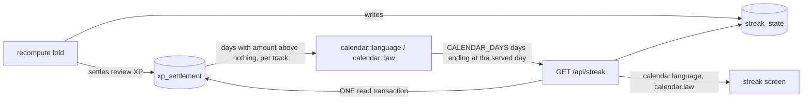

# The streak calendar: markers derived on read

`GET /api/streak` serves `calendar` beside the counts (SPEC-076 section 27, ADR-302).

The walk (`replay::walk`, shared with `replay::language`) visits each day from the first study day
to the served day. A transition that spent a freeze puts `freeze` on the one non-skip day between the
last study day and the return day; a transition that broke the run puts `break` on its own day; each
skip day carries `skip`. The window then keeps the last `CALENDAR_DAYS` days.
