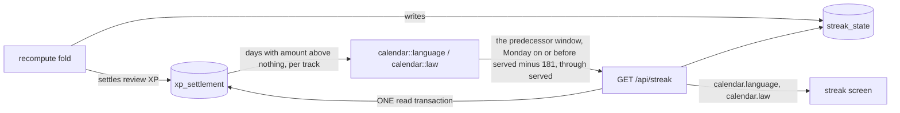

# The streak calendar: markers derived on read

`GET /api/streak` serves `calendar` beside the counts (SPEC-076 section 27, ADR-302).

The walk (`replay::walk`, shared with `replay::language`) visits each day from the first study day
to the served day. A transition that spent a freeze puts `freeze` on the one non-skip day between the
last study day and the return day; a transition that broke the run puts `break` on its own day (the
day after the second real miss); each skip day carries `skip`. The law walk puts `break` on the day
after the first real miss of a live run, the day its replay resets the run. The window then keeps
the predecessor's days: from the Monday on or before the served day minus `CALENDAR_LOOKBACK_DAYS`
(181) through the served day, 182 to 188 days, and the screen lays them out as whole weeks, Monday
first.
