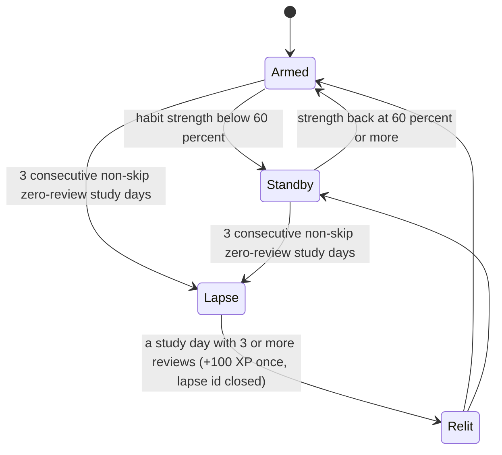

# Schematic: streaks, freezes, the governor and the relight

Kind: state machine. Read at the predecessor's `27ee2bc` (`gamification/streaks.py` gap outcomes and
`decay_on_lapse`, `governor.py`, the relight ritual) and at DeckStreak `main` 769ee62 (`streaks`
context). Constants: start freezes 1, cap 3, one freeze per 7 streak days, comeback minimum 7,
strength half-life 13 days, standby below 60 percent, lapse after 3 non-skip zero-review days,
relight on 3 reviews for 100 XP once.

```mermaid
stateDiagram-v2
  [*] --> Active: first study day (bootstrap)
  Active --> Active: study day, 0 real misses (continue); +1 freeze every 7th day, cap 3
  Active --> Active: 1 real miss and a freeze banked (consume 1)
  Active --> Active: declared skip day (bridged, free)
  Active --> Broken: 2 or more real misses, or 1 miss with no freeze
  Broken --> Active: next study day starts at 1 (a 7+ day break arms the comeback)
  note right of Broken: a non-study day zeroes the streak only once it is provably unsavable
```

In Standby, penalties refuse, wagers void with a refund and markets hide. In Lapse, the whole
discipline engine is silent, digests and morning messages switch to comeback mode, and the lapse
id keys the comeback cap (three messages) and the one comeback reading. The law streak counts days
with a law review, is bridged by skip days, has no freezes, and (unlike the predecessor, whose law
row never decayed) decays on the same unsavable rule: the predecessor's defect is fixed, not ported.

**W1 builds the lapse episode alone** (SPEC-049), ahead of this machine: a pure function in `streaks`
over the study days, their qualifying review counts and the skip days its caller supplies. A lapse
is open when the silent run that ends on the current study day holds three study days that are not
skip days (a skip day neither counts nor ends the run); its id is the epoch day of the run's first
such day, the predecessor's episode anchor; the next study day with a qualifying review closes it.
A return day of one or two reviews therefore closes the lapse id with no relight, as in the
predecessor, whose `pipeline_layers/governor.py:GovernorLayer._update_governor` ends the silent run
at any study day and whose relight (`pipeline_layers/showcase.py:ShowcaseLayer._relight`) pays only
at `constants.py:RELIGHT_CARDS` reviews. Strength, standby, decay and the relight stay W3's.
