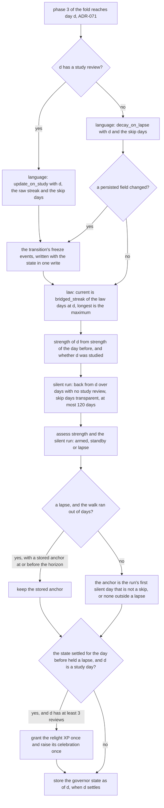
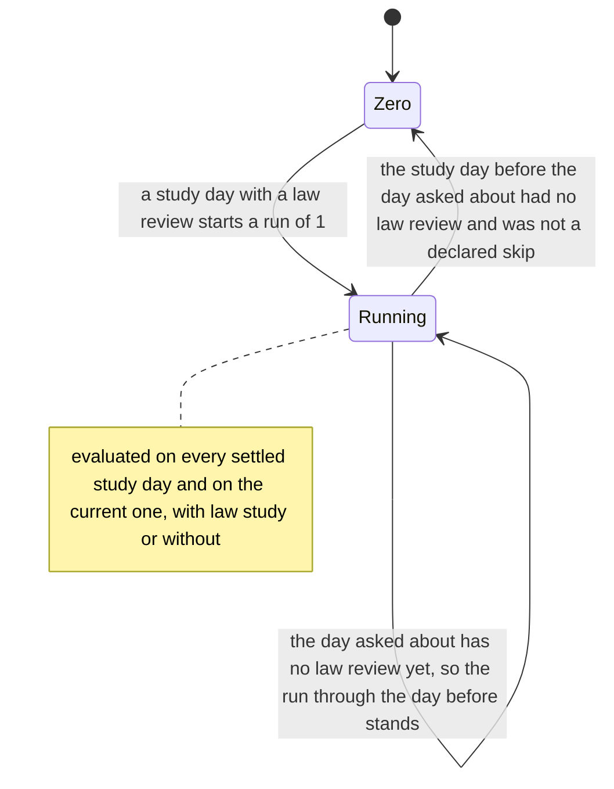
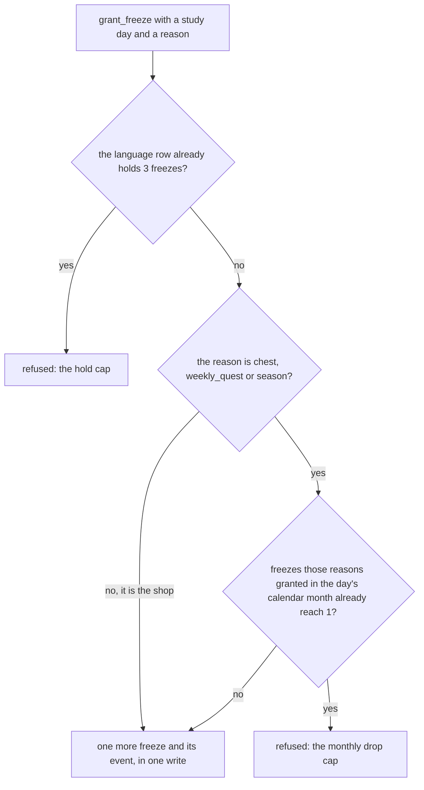
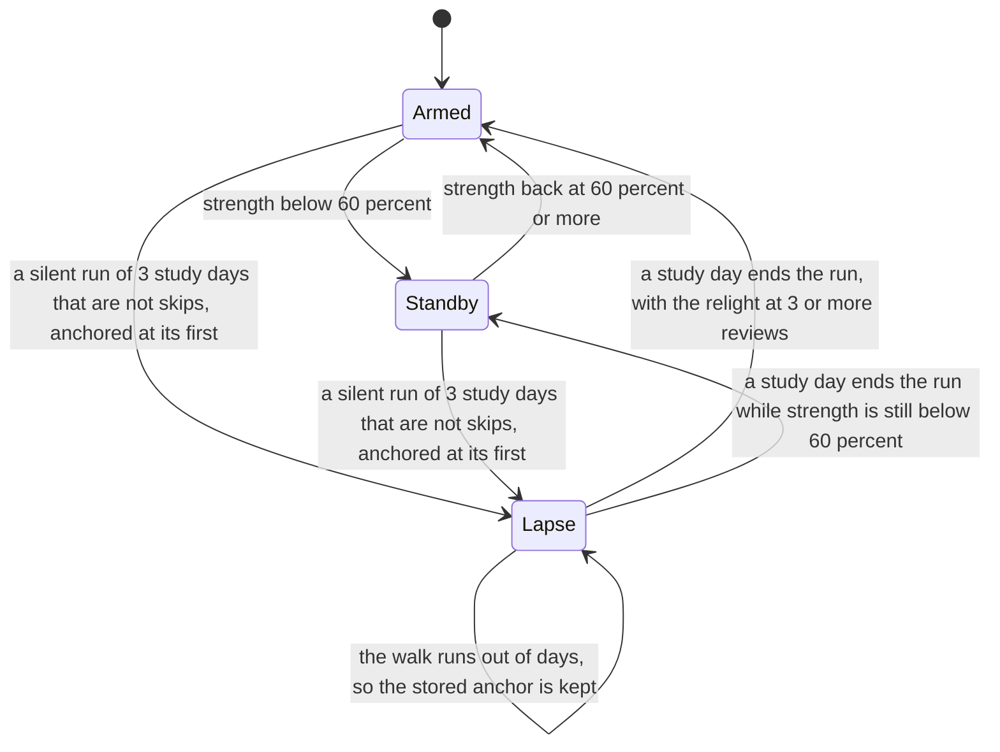

# Schematic: streaks, freezes and the governor across every settled study day

Kind: state machine and data flow. Read at DeckStreak `dev` c3d769b and at the predecessor's
`27ee2bc` (`gamification/streak.py`, `skip.py:real_misses`, `analytics.py:bridged_streak`,
`gamification/strength.py:advance`, `gamification/governor.py:assess`,
`pipeline.py:GamifyPipeline._advance_streak` and `_freeze_events_for`,
`pipeline_layers/governor.py:GovernorLayer._update_governor`,
`pipeline_layers/showcase.py:ShowcaseLayer._relight`, and the freeze grants of
`pipeline_layers/economy.py:EconomyLayer.buy_item`, `pipeline_layers/loot.py:LootLayer._update_weekly_quest`,
`LootLayer.pick_epic_prize` and `pipeline_layers/showcase.py:ShowcaseLayer._evaluate_season_nodes`).
Added by SPEC-076.

It extends `docs/schematics/streaks-and-governor-state-machine.md`, which stands as written: that
file draws the streak's and the governor's states; this one draws how W3 drives them once for every
settled study day (ADR-071), the law streak's daily evaluation (ADR-076), the one freeze port every
freeze source calls, and the lapse anchor stored past the silence walk.

## The streak step of one study day

The step runs in phase 3 of SPEC-071's fold, for every study day the fold settles, in order, and
then for the current study day. Each call is idempotent for its day: a second recompute of one day
changes nothing. The days the first recompute backfills with no today-only rule advance neither
track; strength folds them, and the first day the fold settles bootstraps an empty language row
from its raw streak, as the predecessor's first run did. The relight sits in phase 3 too, after the
governor, so its XP is in the day's base before the derived bonuses and the mint read it.

The governor state is stored only when a day settles, so the current study day's verdict is read
from the state settled for the day before and the current day's reviews so far. A return day whose
third review lands after a mid-day recompute therefore still relights at its settle, which reads
the day's whole count. The language row, by contrast, is written at every recompute: a study day
already recorded is the classifier's same-day case and changes nothing.

## The law streak (ADR-076)

The predecessor's caller wrote this row only on days with a law review, so the move back to Zero
never ran and a finished streak kept its value. DeckStreak asks the same function on every day. The
law row has no freezes: nothing consumes one from it or grants one to it.

## The freeze port

Only the streaks context writes `streak_state` and `freeze_events`. Every freeze that does not come
from the streak's own transitions is requested through one port, in coordination.

| reason | requested by | what a refusal means to the caller |
|---|---|---|
| `shop` | the shop's freeze purchase (SPEC-082) | the purchase writes no coin movement and says why |
| `chest` | an Epic chest's choice (SPEC-081), for the chest's own study day | the choice becomes a Double-XP token, labelled as such |
| `weekly_quest` | the weekly quest's reward (SPEC-080) | the reward pays its Epic chest without the freeze |
| `season` | season node 5 (SPEC-074) | the node pays its coins without the freeze |

`streak_earn` (one every 7 streak days), `consumed` and `streak_break` are the streak's own
transitions, written with the state they change, never requested through the port.

## The governor and its stored anchor

The anchor is SPEC-049's lapse id. For every silent run shorter than the walk it is computed exactly
as SPEC-049's slice computes it (the golden `lapse_episode`); the stored value matters only past the
walk, where the predecessor kept it rather than let the walk's horizon slide and open a new episode
every day (the golden `lapse_anchor_beyond_the_walk`). The standby notice's rule (entering standby,
outside a lapse and outside quiet hours, and not within 7 days of the last notice) is computed here;
no notice is sent until the first discipline device exists (#109).

## What each step reads and writes

| step | reads | writes |
|---|---|---|
| language streak | the day's study reviews and the raw streak (through coordination), the declared skip days, the stored row | `streak_state` (language), `freeze_events` |
| law streak | the window's law study days, the declared skip days | `streak_state` (law) |
| strength | whether each day since the first study day was studied | `habit_strength` |
| governor | the strength, the silent run, the stored state | `governor_state` |
| relight | the day's review count, the governor state settled for the day before | progression's grant port, and the router |
| freeze port | the language row, the month's drop events | `streak_state` (language), `freeze_events` |
