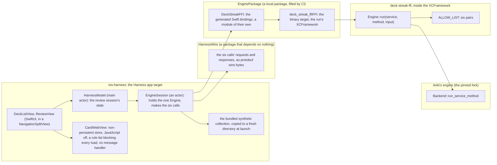
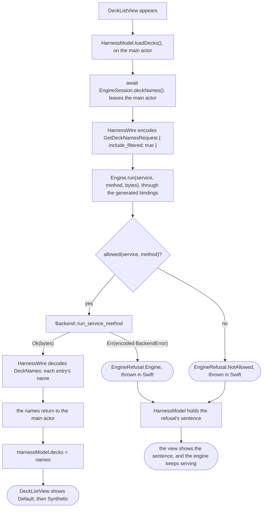
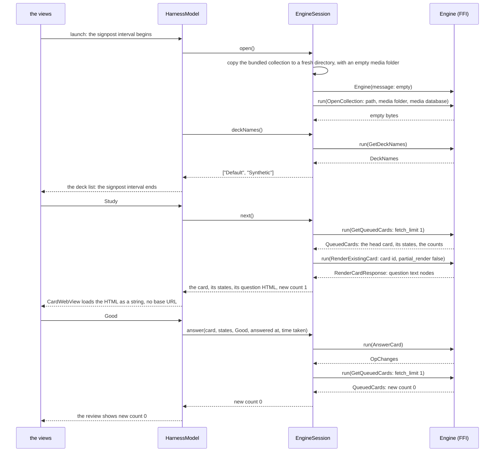
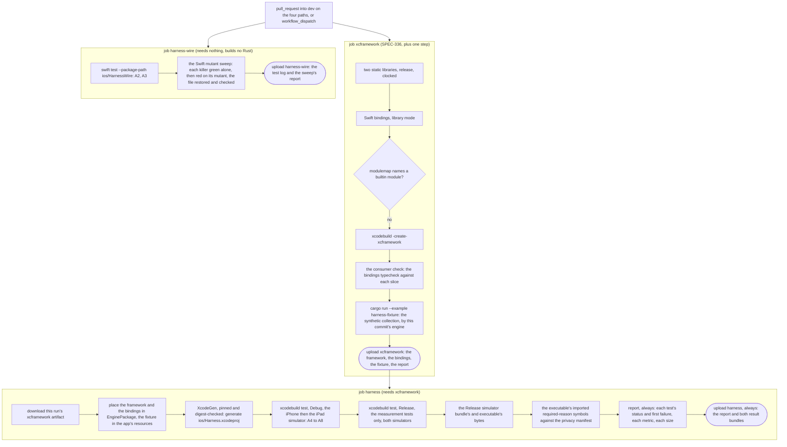

# Schematic: the Swift harness, one call from a view to the engine and back, and its CI jobs

Kind: component, then a data flow (one call), then a sequence (one review), then the CI job graph.
Decided by ADR-350, built by SPEC-339. Read at 7507d8a2 against SPEC-336's adapter
(`crates/ffi/src/lib.rs`, `crates/ffi/src/allow_list.rs`, `crates/ffi/src/engine.rs`), its workflow
(`.github/workflows/xcframework.yml`) and its schematic
(`docs/schematics/ffi-adapter-xcframework-and-swift-package.md`), whose dashed Swift package this
harness makes solid.

## The components

The harness is a client at the edge. It depends on no context: it links the adapter's XCFramework,
which depends on the engine alone (ADR-345 D1).

No arrow reaches a DeckStreak context, the coordination crate or the daemon. The context map's
line for the harness reads `depends on: nothing internal`, as the Mini App's does.

## One call, from a view to the engine and back

The deck list's load, as one example; the other five calls take the same path with their own
request and response.

## One review, launch to answer

`GetQueuedCards` reads the collection's current deck, which is `Default` in a new collection; no
allowed call changes it, so `Study` studies `Default` whatever row is highlighted (SPEC-339
section 5). On an iPhone the split view collapses to a stack that starts on the deck list; on an
iPad both columns show. The session's state is the model's, so the collapse keeps it.

## The CI job graph

`xcframework.yml` runs on a pull request into `dev` that changes `crates/ffi/**`, `ios/**`,
`Cargo.lock` or the workflow itself, and on a dispatch. Every job runs on the one macOS runner the
hardening test admits to this file by name, with a read-only token and no secret.

The Linux CI runs A1 (the render round trip) with the adapter's other tests, and A9 and A10 with
the hardening tests, on every pull request; those three never need the macOS runner. A failed
`xcframework` job skips `harness`, because its `needs` failed, and its report still uploads.
`harness-wire` runs beside both and fails on its own.
