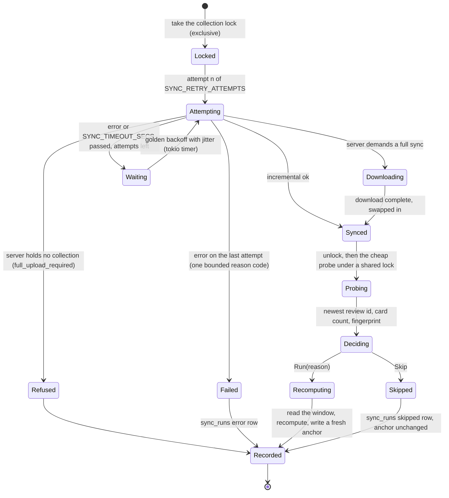

# Schematic: one sync cycle, from the retrying sync to the change gate's decision

Kind: state machine. Read at DeckStreak `main` e05dfa5 (ADR-008, ADR-009,
`docs/schematics/data-flow.md`), and at the predecessor's `27ee2bc` for the behaviour it ports
(`sync.py:AnkiSyncer.sync_now`, `pipeline.py:GamifyPipeline._sync_attempts`,
`pipeline.py:GamifyPipeline._maybe_skip_recompute`, `pipeline.py:GamifyPipeline._first_due_obligation`,
`anki_reader.py:probe_change_signal`). Decided by ADR-009 and ADR-022; built by SPEC-022 (the sync)
and SPEC-023 (the read and the gate).

`decide` runs the recompute when ANY of these holds, in this order, and skips only when none does:

| term | source |
|---|---|
| an owner rescore is pending (consumed once) | `ingest_state` |
| this cycle's sync failed | the sync outcome |
| no successful run on record, or the last run failed | `sync_runs` |
| the anchor is missing or unreadable | `ingest_state` |
| the settings generation changed | the kernel's `settings_generation` |
| the study day changed | the kernel's study-day rule and clock |
| the newest review id, the card count or the fingerprint changed | the probe |
| a registered deadline lies after the anchor's last recompute and at or before now | `coordination::obligations` |

The last term is the one an input-keyed gate cannot see: an obligation comes due precisely on a
cycle in which nothing in the collection changed. Every deadline-bearing feature registers its
source there in the delivery that builds it.
