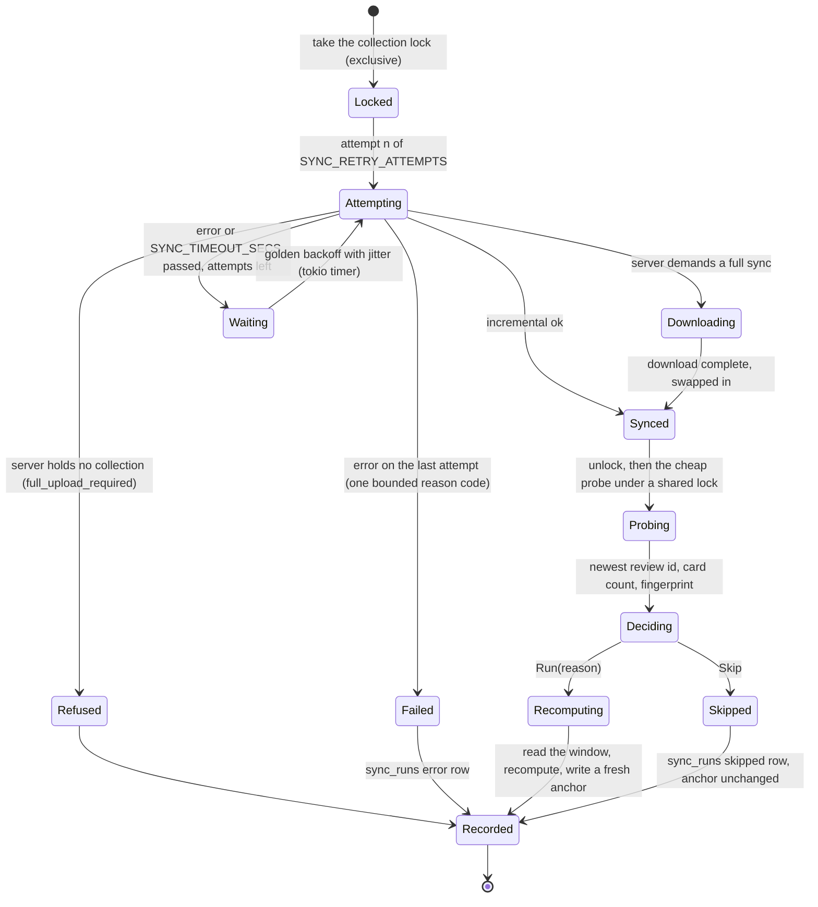
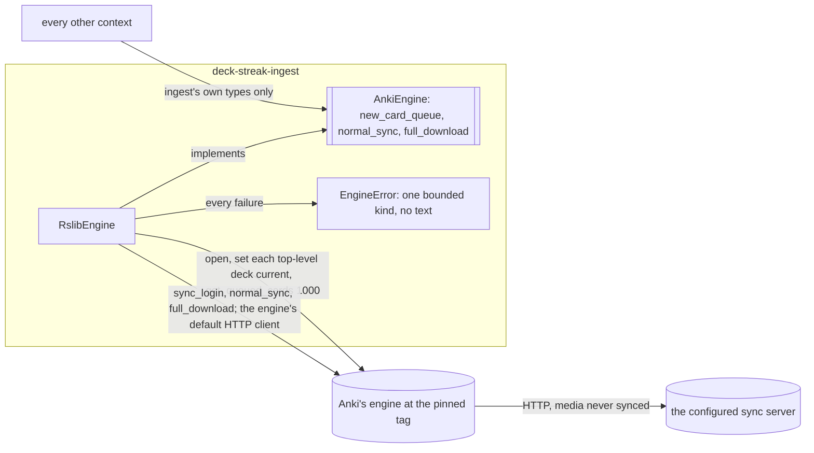

# Schematic: one sync cycle, from the retrying sync to the change gate's decision

Kind: state machine. Read at DeckStreak `main` e05dfa5 (ADR-008, ADR-009,
`docs/schematics/data-flow.md`), and at the predecessor's `27ee2bc` for the behaviour it ports
(`sync.py:AnkiSyncer.sync_now`, `pipeline.py:GamifyPipeline._sync_attempts`,
`pipeline.py:GamifyPipeline._maybe_skip_recompute`, `pipeline.py:GamifyPipeline._first_due_obligation`,
`anki_reader.py:probe_change_signal`). Decided by ADR-009 and ADR-022; built by SPEC-022 (the sync)
and SPEC-023 (the read and the gate).



`decide` runs the recompute when ANY of these holds, in this order, and skips only when none does:

| term | source |
|---|---|
| an owner rescore is pending (consumed once) | `ingest_state` |
| this cycle's sync failed | the sync outcome |
| no successful run on record, or the last run failed | `sync_runs` |
| the anchor is missing or unreadable | `ingest_state` |
| the settings generation changed | the kernel's `settings_generation` |
| the study day changed | the kernel's study-day rule and clock |
| the newest review id, the card count or the fingerprint changed | the probe |
| a registered deadline lies after the anchor's last recompute and at or before now | `coordination::obligations` |

The last term is the one an input-keyed gate cannot see: an obligation comes due precisely on a
cycle in which nothing in the collection changed. Every deadline-bearing feature registers its
source there in the delivery that builds it.

## The engine port and its measurement

Kind: component, then sequence. Built by SPEC-022's spike (A1 to A3), decided by ADR-009 and
ADR-022, read at Anki's tag `26.05` (`rslib/src/sync/collection/normal.rs`,
`rslib/src/sync/collection/download.rs`, `rslib/src/sync/http_server/mod.rs`).



The port is the anti-corruption layer: nothing outside `ingest` names an engine type, and an
`EngineError` carries no text from the engine, so it cannot carry a path, the endpoint or a
credential. A full download is the engine's own: it holds the downloaded collection in memory,
writes it beside the copy, opens it with an integrity check and renames it over the copy, so the
old copy survives any failure before the rename.

Each budget test measures one operation in a process that does nothing else:

```mermaid
sequenceDiagram
  participant T as budget test (the parent)
  participant S as the same test binary as sync-server
  participant M as the same test binary as measure
  T->>T: build ADR-022's synthetic collection by bulk inserts
  T->>S: spawn, with SYNC_USER1 set by Command::env
  S-->>T: its loopback address, on stdout
  T->>M: spawn, handing it the endpoint and the copy's path
  M->>S: log in, then full download (or open and queue, with no server)
  M-->>T: VmHWM, read when the operation returns
  T->>T: the copy holds every card and review; VmHWM within 256 MiB
  T->>S: close its stdin, so it exits
```

| process | holds | why |
|---|---|---|
| the parent | the fixture's build, the checks | its memory is not the operation's |
| `sync-server` | the engine's server over the synthetic collection | the owner's server is another machine; the engine reads its users only from the process environment, which safe Rust sets only for a child |
| `measure` | one port call, then `VmHWM` | its peak is the operation's peak |

`engine-measure.yml` measures the rest on a hosted `ubuntu-24.04` runner with no cache: the
clock runs from the `protoc` download to the built release probe, then the probe is stripped and
sized, the budget tests run in the release profile the measured build compiled, and
`cargo deny check licenses` runs over the lockfile. Its report is ADR-009's Confirmation table.
