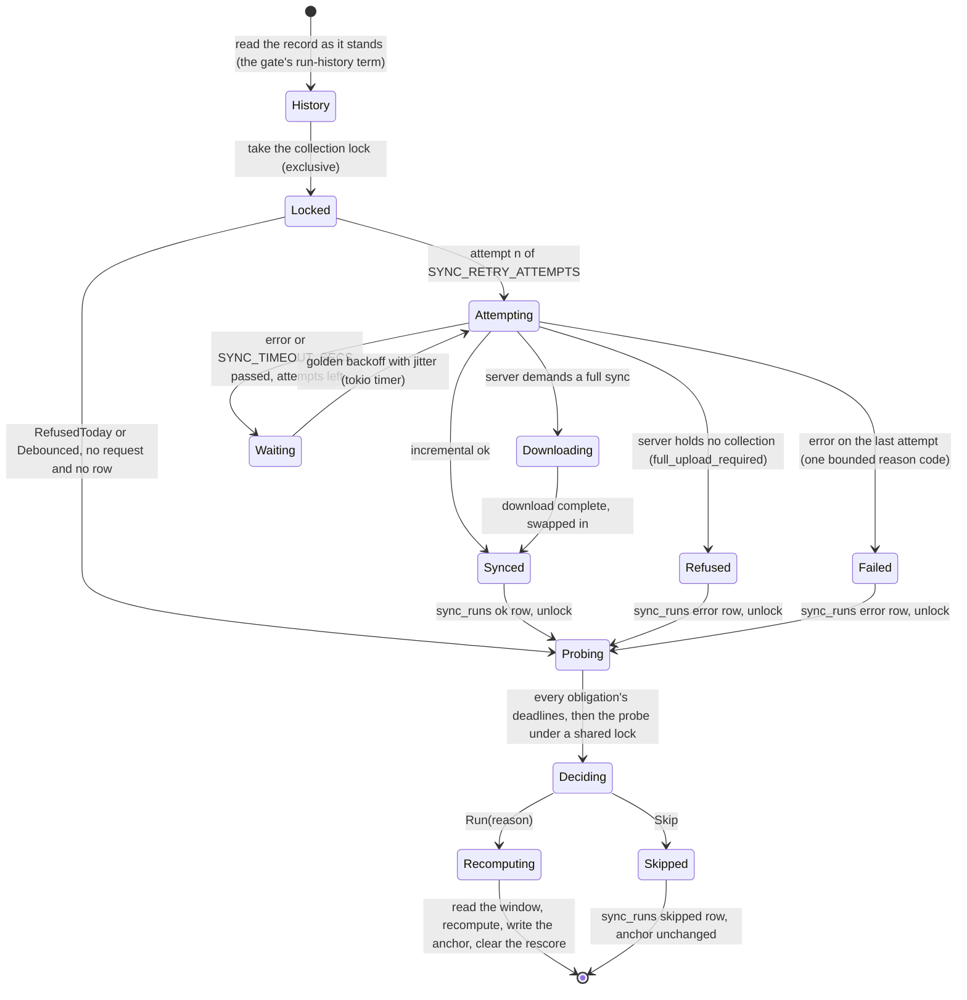
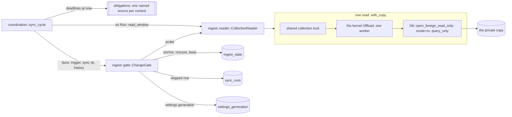
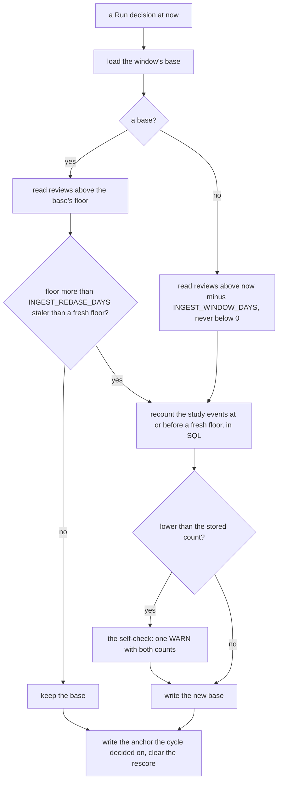
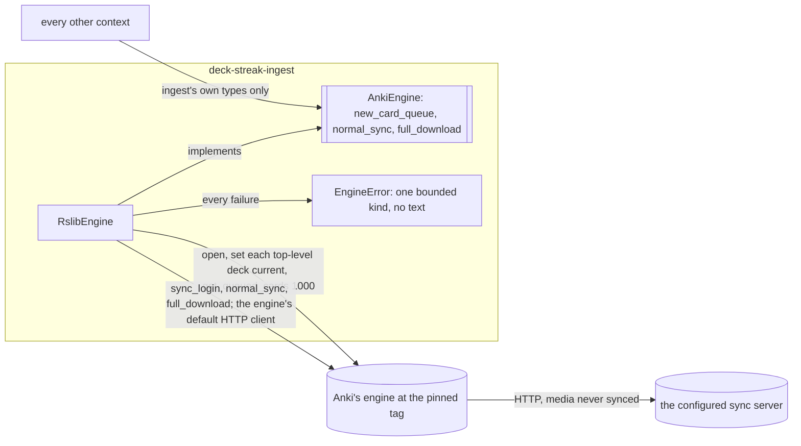
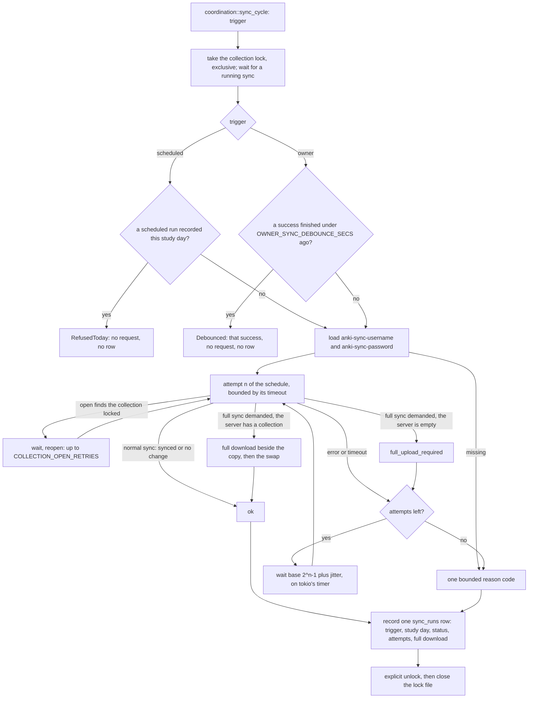
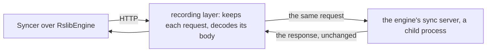

# Schematic: one sync cycle, from the retrying sync to the change gate's decision

Kind: state machine. Read at DeckStreak `main` e05dfa5 (ADR-008, ADR-009,
`docs/schematics/data-flow.md`), and at the predecessor's `27ee2bc` for the behaviour it ports
(`sync.py:AnkiSyncer.sync_now`, `pipeline.py:GamifyPipeline._sync_attempts`,
`pipeline.py:GamifyPipeline._maybe_skip_recompute`, `pipeline.py:GamifyPipeline._first_due_obligation`,
`anki_reader.py:probe_change_signal`). Decided by ADR-009 and ADR-022; built by SPEC-022 (the sync)
and SPEC-023 (the read and the gate), whose delivery made the gate's half of this diagram exact.



`decide` is a pure function of the inputs below. It runs the recompute for the FIRST of these terms
that holds, in this order, and skips only when none does:

| term | reason | source |
|---|---|---|
| an owner rescore is pending | `rescore_pending` | `ingest_state` |
| this cycle's sync failed | `sync_failed` | the sync's report; a refused or debounced sync made no request and counts as healthy |
| no run on record succeeded | `no_successful_run` | `sync_runs`, read before the cycle's own sync |
| the last run on record failed | `last_run_failed` | `sync_runs`, read before the cycle's own sync |
| the anchor is missing | `anchor_missing` | `ingest_state` (every anchor column NULL) |
| the anchor is unreadable | `anchor_unreadable` | `ingest_state` (the row gone, or some anchor columns NULL) |
| the settings generation changed | `settings_changed` | the kernel's `settings_generation` |
| the study day changed | `study_day_changed` | the kernel's study-day rule and clock, never the collection's rollover |
| the newest review id changed | `newest_review_changed` | the probe |
| the card count changed | `card_count_changed` | the probe |
| the card fingerprint changed | `card_fingerprint_changed` | the probe |
| a registered deadline lies after the anchor's recompute and at or before now | `deadline_due` | `coordination::obligations` |

The last term is the one an input-keyed gate cannot see: an obligation comes due precisely on a
cycle in which nothing in the collection changed. Every deadline-bearing feature registers its
source there in the delivery that builds it.

## The read, the window and the obligations (SPEC-023)

Kind: component, then flow. Built by SPEC-023, decided by ADR-009 (read-only SQLite over the copy,
bounded to the window) and ADR-002 (cross-context work in `coordination`), read at the predecessor's
`27ee2bc` (`anki_reader.py:read_collection`, `deck_filter.py:allowed_deck_ids`,
`pipeline.py:GamifyPipeline._maybe_rebase_ingest`, `_obligation_deadlines`).



Every read of the copy is one session: the shared lock (so it never sees a sync's swap), then the
offload (so it never stalls the runtime or runs beside another collection read), then a read-only
connection (so any write through it is refused by `SQLite`, `query_only` and `mode=ro` both). Deck
names are read by id and matched in Rust; the card and review queries filter by the allowed deck ids,
integers bound as one JSON array that `json_each` expands, and no SQL predicate, ordering or aggregate
touches a name column, so a collection whose names are collated `unicase` reads with no collation.



The anchor a recompute writes is the probe its own cycle read before the read, with the study day,
the instant and the settings generation that cycle decided on. A sync that lands between the probe and
the read therefore makes the next cycle run again rather than skip, and a deadline at or before the
decision's instant is one the recompute saw. A deadline counts in the window (anchor, now]: one not
yet due, or one a recompute has served, never holds the gate open, so each costs exactly one
recompute.

## The engine port and its measurement

Kind: component, then sequence. Built by SPEC-022's spike (A1 to A3), decided by ADR-009 and
ADR-022, read at Anki's tag `26.05` (`rslib/src/sync/collection/normal.rs`,
`rslib/src/sync/collection/download.rs`, `rslib/src/sync/http_server/mod.rs`).



The port is the anti-corruption layer: nothing outside `ingest` names an engine type, and an
`EngineError` carries no text from the engine, so it cannot carry a path, the endpoint or a
credential. A full download is the engine's own: it holds the downloaded collection in memory,
writes it beside the copy, opens it with an integrity check and renames it over the copy, so the
old copy survives any failure before the rename.

Each budget test measures one operation in a process that does nothing else:

```mermaid
sequenceDiagram
  participant T as budget test (the parent)
  participant S as the same test binary as sync-server
  participant M as the same test binary as measure
  T->>T: build ADR-022's synthetic collection by bulk inserts
  T->>S: spawn, with SYNC_USER1 set by Command::env
  S-->>T: its loopback address, on stdout
  T->>M: spawn, handing it the endpoint and the copy's path
  M->>S: log in, then full download (or open and queue, with no server)
  M-->>T: VmHWM, read when the operation returns
  T->>T: the copy holds every card and review; VmHWM within 256 MiB
  T->>S: close its stdin, so it exits
```

| process | holds | why |
|---|---|---|
| the parent | the fixture's build, the checks | its memory is not the operation's |
| `sync-server` | the engine's server over the synthetic collection | the engine reads its users only from the process environment, which safe Rust sets only for a child |
| `measure` | one port call, then `VmHWM` | its peak is the operation's peak |

`engine-measure.yml` measures the rest on a hosted `ubuntu-24.04` runner with no cache: the
clock runs from the `protoc` download to the built release probe, then the probe is stripped and
sized, the budget tests run in the release profile the measured build compiled, and
`cargo deny check licenses` runs over the lockfile. Its report is ADR-009's Confirmation table.

## One sync run, and the census

Kind: flow. Built by SPEC-022's phase 2 (A4 to A17), decided by ADR-037 (one scheduled sync per
study day, the owner's triggers, never an upload), read at the predecessor's `27ee2bc`
(`pipeline.py:GamifyPipeline._sync_attempts`, `sync.py:AnkiSyncer._sync_blocking`).



The census (A15) puts a recording layer between the syncer and the engine's server. It keeps
every request, decompresses each body, and fails the test on `upload` or on any body that carries
a local change: a note type, deck, deck configuration, tag, configuration or creation stamp in
`applyChanges`, a grave in `applyGraves` or `start`, or a review, card or note in `applyChunk`.


