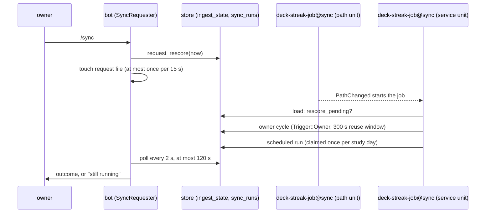

# Schematic: the owner's sync request, the doorbell and the job

Kind: sequence and component. Decided by ADR-066; built by SPEC-059.

## 1. The sequence

## 2. The components

The request directory belongs to the service user, mode 0700, and only the bot unit may write
it. The path unit loads no credential. The job unit sees the directory read-only.

## 3. The states of one request

`requested` (flag set) -> `started` (path unit fired) -> `done` (flag cleared, a run row or a
reuse) or `pending` (bound reached: the owner is told it is still running).
