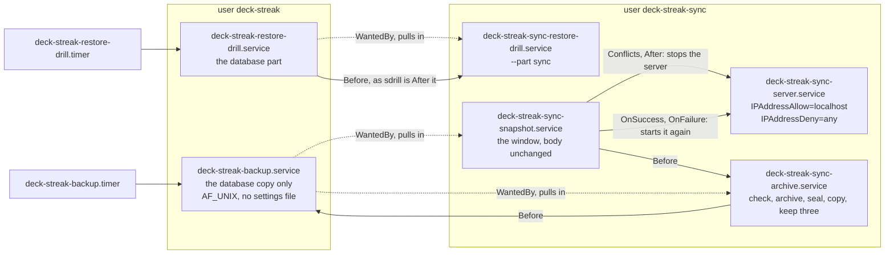
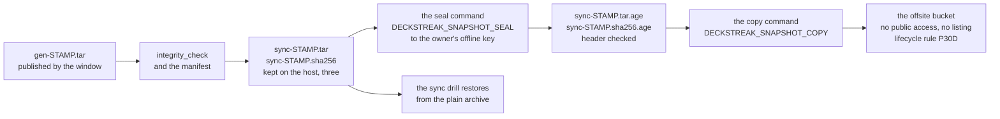
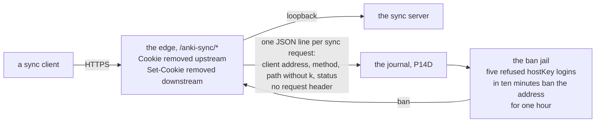

# Schematic: the sync server's hardening, its units by user, its offsite path, and its edge and ban

Kind: component and data flow. Added by SPEC-340; ADR-351 decides it, with ADR-347's amendment D13.
Every `path:line` below was read at DeckStreak `dev` c56bbd11, the base this delivery cuts from, and
names the line a cure changes. It amends `docs/schematics/sync-server-packaging-and-cutover.md`'s
data flow for the archive and the drill; that schematic's cutover state sequence is unchanged,
apart from the `rekeyed` step's wording, which the runbook carries. Every host step is the owner's
go (#161).

## The unit graph after SPEC-340 (component)

| unit | user | `StateDirectory=` (order kept) | network | where at c56bbd11 |
|---|---|---|---|---|
| server | deck-streak-sync | `deck-streak-sync-server` | AF_UNIX AF_INET, loopback peers only | `deploy/systemd/deck-streak-sync-server.service:22-23`, `:59`, `:73` |
| window | deck-streak-sync | `deck-streak-sync-snapshots deck-streak-sync-server` | AF_UNIX | `deploy/systemd/deck-streak-sync-snapshot.service:26-27`, `:29` |
| archive | deck-streak-sync | `deck-streak-sync-snapshots` | AF_UNIX AF_INET AF_INET6, for the copy | new; its work was `deploy/scripts/backup.py:227-269`, run from `main()` at `:272-291` |
| sync drill | deck-streak-sync | `deck-streak-sync-snapshots` | AF_UNIX | new; its work was `deploy/scripts/restore-drill.sh:110-185` |
| backup | deck-streak | `deck-streak` | AF_UNIX | `deploy/systemd/deck-streak-backup.service:20-21`, `:45-46` |
| drill | deck-streak | `deck-streak` | unchanged | `deploy/systemd/deck-streak-restore-drill.service:13` |

No directory is named by units of both users. `backup.py` reads `STATE_DIRECTORY` in order: the
window's first entry is the snapshots' root and its second is the store, as now. The window's edges
are the model's (`formal/tla/SyncSnapshotWindow/SyncSnapshotWindow.tla:60` maps its trigger to
`WantedBy=deck-streak-backup.service`); the archive, the sync drill and the users are outside the
model, and its three stamped bodies (`SyncSnapshotWindow.tla:2-4`) are unchanged.

## The offsite path (data flow)

An unset seal, a non-zero seal or a sealed file without the header fails the archive unit with
nothing copied. The sealed files are removed in every case. The copy was
`deploy/scripts/backup.py:258`, after the renames at `:256-257`.

## The edge and the ban (data flow)

The route is `deploy/caddy/deck-streak.caddy:44-60` and its `reverse_proxy` is `:55-59`; the site
had no `log` directive at c56bbd11. The jail's filter and its jail are new, under
`deploy/fail2ban/`, and are installed only on the owner's go (#161).
