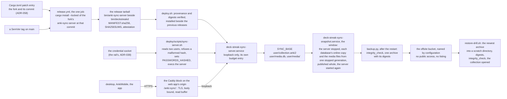
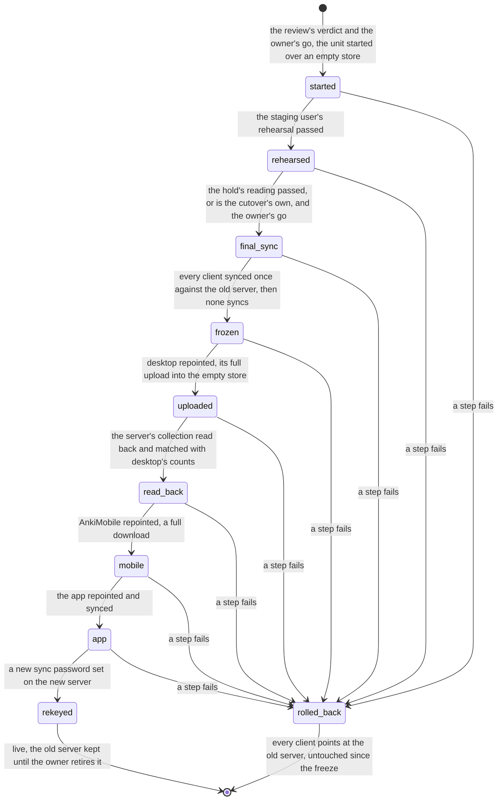

# Schematic: the sync server from the tag to the restore, and the cutover as a state sequence

Kind: data flow and state machine. Read at DeckStreak `dev` 03a4f16f (`Cargo.toml`'s `[patch]`
entry, `.github/workflows/release.yml`, `deploy/systemd/`, `deploy/caddy/deck-streak.caddy`,
`deploy/scripts/render-caddy.py`, `deploy/scripts/backup.py`, `deploy/scripts/restore-drill.sh`,
`deploy/host-budget.json`) and against ADR-340 as proposed. Added by SPEC-337; ADR-347 decides
it, under ADR-340 (the move), ADR-058 and ADR-336 (the fork), ADR-032 (the budget), ADR-064 (the
backup), ADR-010 and ADR-038 (the credentials). Every host step in it is the owner's go (#161).
The snapshot's window was read at this delivery's c54c898d
(`deploy/systemd/deck-streak-sync-snapshot.service`, `deploy/scripts/backup.py`), after ADR-347 D12.
SPEC-340 moves the archive and the sync drill into units of their own, run as the sync family's
user, seals the offsite copy and logs and bounds the route: `docs/schematics/sync-server-hardening.md`
draws them, and where it differs from this flow's `snapshot` and `drill` nodes, it holds.

## The data flow

One pin feeds the build; one tarball carries the server beside `deckstreakd`; the deploy that
verifies the tarball (ADR-062) installs it; the unit reads its users from the credential socket;
the edge is the only way in; the daily backup's run stops the server for a window, copies its
data from that one stopped generation and starts it again, then checks, archives and copies the
copy offsite; the weekly drill restores the copy and opens it.

| edge | what crosses it | where it is decided |
|---|---|---|
| pin to build | the fork's URL and the 40-hex commit, read from the manifest at the tag; nothing else names them | ADR-347 D1, SPEC-337 R1 |
| build to tarball | one binary, digested by MANIFEST.sha256 and covered by the one attestation | ADR-062, SPEC-337 R1 |
| socket to launcher | two entries of the form `name:<PHC hash>`, never a password | ADR-347 D2, SPEC-337 R2 |
| route to unit | requests under `/anki-sync/` with the prefix stripped; the server's health route answers 404 at the edge | ADR-347 D4, SPEC-337 R4 |
| base to window | with the server stopped, each user's two databases by SQLite's online backup, refused at once when a process holds one, and the media files, all from one stopped generation; the server is started again on success and on failure | ADR-347 D12, SPEC-337 R5 |
| window to snapshot | one generation, published by a rename only when whole; the check, the archive and its digests run on it after the restart | ADR-347 D12, ADR-064 |
| offsite to drill | the archive, restored into a scratch directory the drill removes | ADR-347 D5, SPEC-337 R5 |

The server holds each user's `media.db` locked for its whole life, so no copy reads it while the
server runs (SPEC-337 §6); the window is where the copy reads (ADR-347 D12). The window's
interleavings, the server's stop and start, a client's sync and the copy, are the model
`formal/tla/SyncSnapshotWindow`'s.

## The cutover as a state sequence

ADR-340's one window, in order, with the data moved by the server's documented path (ADR-347 D10):
every client syncs once against the old server, then desktop's full upload fills the new server's
EMPTY store, and the other clients take a full download from it. Nothing copies the old server's
store. The staging sync user (ADR-344) rehearses the same sequence on the new server first, with
a scrubbed collection. The old server is never written by any state: the rollback repoints the
clients to it and stops the new unit, so it is reachable from every state up to the new password.
The cutover's full upload is held to the runbook's three conditions (ADR-347 D7): the first full
upload under the unit's real quota is the reading that counts, taken in the rehearsal when that
needs no change to the deploy, and a client failure or a long stall there stops the cutover.

Where each state happens, and whose go starts it; the runbook marks each step the same way:

| state | where | whose go |
|---|---|---|
| `started` | the host: the unit and the route | the owner's go (#161) |
| `rehearsed` | the new server, the staging user's store; two scratch desktop profiles | the owner's go (#161) |
| `final_sync` | the owner's devices, against the old server | the owner's own act |
| `frozen` | the owner's devices | the owner's own act |
| `uploaded` | desktop, against the new server | the owner's own act |
| `read_back` | the host: the new store, read only | the owner's go (#161) |
| `mobile` | AnkiMobile, against the new server | the owner's own act |
| `app` | the app, against the new server | the owner's own act |
| `rekeyed` | the host: the owner's credential; then each client's login | the owner's go (#161) |
| `rolled_back` | the host: the new unit stopped; then each client repointed | the owner's go (#161) |

What the sequence holds, each a line of the runbook (`docs/runbooks/sync-server-cutover.md`):

- Nothing of the owner's moves before the rehearsal passed and the hold's reading allows it:
  `final_sync` is reachable only from `rehearsed`, and `rehearsed` only from `started`.
- The upload goes into an EMPTY store, by the server's own full upload; the old server's store is
  never copied (ADR-347 D10).
- The read-back precedes any retry: a full upload the client reports as failed may have landed on
  the server (SPEC-337 §6), so the counts decide, and the upload is repeated only when they differ
  (ADR-347 D11).
- One client at a time: each repoint follows the previous client's completed sync, so no two
  clients ever disagree about which server is current.
- The old server is read by `final_sync` and by nothing after it. A study made on the new server
  after `uploaded` reaches the old one only by a one-way upload from that client, so the runbook
  rolls back before any study on the new server, or not at all.
- The new password is the last state, so a rollback never meets a password the old server lacks.

## What this schematic does not show

- The host's own steps (the install, the unit's first start, the route's install, the bucket's
  creation and its access policy): each is a command the seat records in #161 before any run.
- The browser client's sync and the one-way upload's snapshot check (SPEC-334 R8, R9), which are
  the app campaign's (#617).
