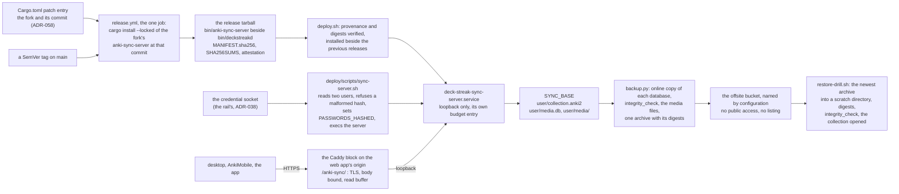
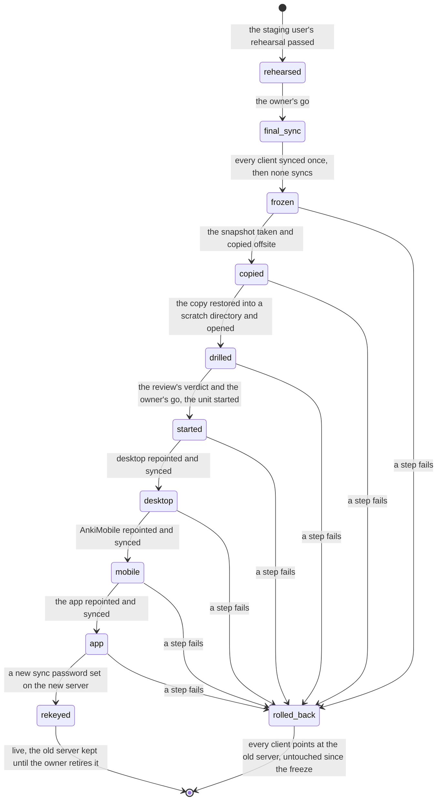

# Schematic: the sync server from the tag to the restore, and the cutover as a state sequence

Kind: data flow and state machine. Read at DeckStreak `dev` 03a4f16f (`Cargo.toml`'s `[patch]`
entry, `.github/workflows/release.yml`, `deploy/systemd/`, `deploy/caddy/deck-streak.caddy`,
`deploy/scripts/render-caddy.py`, `deploy/scripts/backup.py`, `deploy/scripts/restore-drill.sh`,
`deploy/host-budget.json`) and against ADR-340 as proposed. Added by SPEC-337; ADR-347 decides
it, under ADR-340 (the move), ADR-058 and ADR-336 (the fork), ADR-032 (the budget), ADR-064 (the
backup), ADR-010 and ADR-038 (the credentials). Every host step in it is the owner's go (#161).

## The data flow

One pin feeds the build; one tarball carries the server beside `deckstreakd`; the deploy that
verifies the tarball (ADR-062) installs it; the unit reads its users from the credential socket;
the edge is the only way in; the daily backup snapshots the server's data and copies it offsite;
the weekly drill restores the copy and opens it.

| edge | what crosses it | where it is decided |
|---|---|---|
| pin to build | the fork's URL and the 40-hex commit, read from the manifest at the tag; nothing else names them | ADR-347 D1, SPEC-337 R1 |
| build to tarball | one binary, digested by MANIFEST.sha256 and covered by the one attestation | ADR-062, SPEC-337 R1 |
| socket to launcher | two entries of the form `name:<PHC hash>`, never a password | ADR-347 D2, SPEC-337 R2 |
| route to unit | requests under `/anki-sync/` with the prefix stripped; the server's health route answers 404 at the edge | ADR-347 D4, SPEC-337 R4 |
| base to snapshot | a consistent copy of each database while the server runs (SQLite's online backup), never a file copy | ADR-347 D5, ADR-064 |
| offsite to drill | the archive, restored into a scratch directory the drill removes | ADR-347 D5, SPEC-337 R5 |

## The cutover as a state sequence

ADR-340's one window, in order. The staging sync user (ADR-344) rehearses the same sequence first
on a scrubbed copy. The old server is never written by any state: the rollback repoints the clients
to it and stops the new unit, so it is reachable from every state between the freeze and the new
password. Repointing the owner's own devices, and retiring the old server, are the owner's acts.

What the sequence holds, each a line of the runbook (`docs/runbooks/sync-server-cutover.md`):

- Nothing moves before a restored-and-opened copy exists: `started` is reachable only from
  `drilled`.
- One client at a time: each repoint follows the previous client's completed sync, so no two
  clients ever disagree about which server is current.
- The old server is read by `final_sync` and by nothing after it. A study made on the new server
  after `started` reaches the old one only by a one-way upload from that client, so the runbook
  rolls back before any study on the new server, or not at all.
- The new password is the last state, so a rollback never meets a password the old server lacks.

## What this schematic does not show

- The host's own steps (the install, the unit's first start, the route's install, the bucket's
  creation and its access policy): each is a command the seat records in #161 before any run.
- The browser client's sync and the one-way upload's snapshot check (SPEC-334 R8, R9), which are
  the app campaign's (#617).
