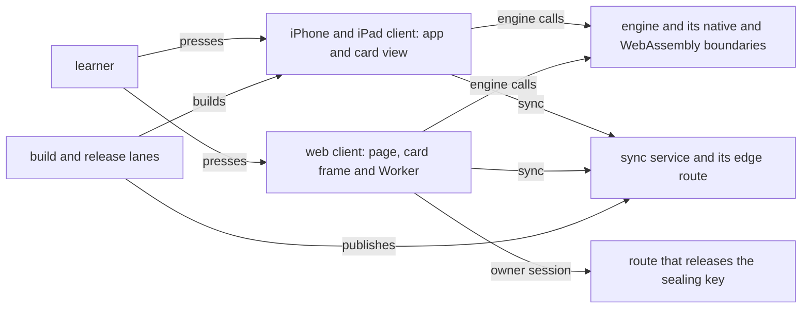

# Schematic: the app campaign's surfaces each carry a STRIDE table whose every control cites a line that holds

Kind: component. Every citation below was read at dev `6b1d6063`; the build re-reads each at its
cut, and `scripts/threat_model.py` holds every one in CI (SPEC-375 R5, A2).

- **SPEC:** SPEC-375. **ADR:** ADR-386. **Issue:** #653. **Cited by:** SPEC-341 §5.
- **Surfaces outside this model:** SPEC-375 §5 names each, with the issue that owns it.

## 1. How to read this model

- The front matter's `trace: threat-model` declares this file the threat model. No other schematic
  declares it.
- Section 2 names each surface and the entry it starts from. Each surface then has its own section,
  `Surface: <name>`, holding one STRIDE table.
- A row's id is its STRIDE class's initial and a number, unique in the model: Spoofing, Tampering,
  Repudiation, Information disclosure, Denial of service, Elevation of privilege. Every surface has
  at least one row of each class.
- The `control` cell cites the line that is the control. The `pinned by` cell cites the test line
  that holds it. A citation is a repository path, a line (or `first-last`) and a quote that the
  cited line contains. A citation that names no file, carries no quote, or whose quote has moved
  off its line is refused.
- The model names each threat by class, the asset it reaches and the control that answers it. A
  row exists only where a control holds at dev and a test pins it.

## 2. Surfaces

| surface | entry point |
|---|---|
| the iPhone and iPad client | `ios/App/Sources/DeckStreakApp.swift:5:@main` |
| the web client | `web/app/src/routes/study/review/+page.svelte:7:<ReviewScreen`, `web/app/src/lib/engine/worker.ts:78:scope.addEventListener('message'`, `crates/api/src/sync_seal_routes.rs:40:pub const SEAL_KEY_PATH` |
| the sync service | `deploy/systemd/deck-streak-sync-server.service:21:ExecStart=`, `deploy/scripts/sync-server.sh:19:set -euo pipefail` |
| the engine and its boundaries | `crates/engine-core/src/lib.rs:44:#![forbid(unsafe_code)]`, `crates/ffi/src/lib.rs:21:#![forbid(unsafe_code)]`, `crates/web-engine/src/wasm.rs:125:#[wasm_bindgen]` |
| the build and release lanes | `.github/workflows/testflight-internal.yml:26:permissions:`, `.github/workflows/testflight-release.yml:11:tags:`, `.github/workflows/release.yml:19:permissions:` |

## 3. Components and trust boundaries

## 4. Surface: the iPhone and iPad client

| id | threat | asset | control | pinned by |
|---|---|---|---|---|
| S1 | a card face navigates its view to a page that poses as the app | what the review screen shows | the navigation gate allows only the view's first main-frame load: `ios/CardIsolation/Sources/CardIsolation/NavigationGate.swift:46:public mutating func decide(_ request: NavigationRequest) -> NavigationDecision {` | `ios/CardIsolation/Tests/CardIsolationTests/NavigationGateTests.swift:24:func test_only_the_first_main_frame_load_is_allowed()` |
| T1 | a card face changes what it shows by loading content from elsewhere | the card face under review | a compiled content rule list blocks every load: `ios/CardIsolation/Sources/CardIsolation/RuleList.swift:48:compileContentRuleList(` | `ios/CardIsolation/Tests/CardIsolationTests/RuleListTests.swift:18:func test_the_rule_list_blocks_every_load_of_every_type()` |
| R1 | an answer is recorded that the learner's press did not give | the review history | the app builds an answer only from a press, through the engine's one constructor: `crates/ffi/src/engine.rs:202:OwnerAnswer::from_press(card, grade)` | `crates/engine-core/tests/answer.rs:272:fn a_press_records_only_its_own_grade()` |
| I1 | the sync credential is restored to another device | the sync credential | the stored item is readable on this device only: `ios/App/Sources/SyncCredentialStore.swift:38:kSecAttrAccessibleAfterFirstUnlockThisDeviceOnly` | `scripts/tests/test_ios_app_tree.py:495:def test_the_app_tree_carries_the_seam_and_keeps_the_credential_in_the_keychain`, `ios/AppTests/CredentialStoreTests.swift:35:accessibility: kSecAttrAccessibleAfterFirstUnlockThisDeviceOnly as String` |
| I2 | a card face keeps or reads storage that outlives its view | what earlier card faces stored | the card view's data store is not persistent: `ios/CardIsolation/Sources/CardIsolation/CardWebViewFactory.swift:204:WKWebsiteDataStore.nonPersistent()` | `scripts/tests/test_card_web_view_layers.py:178:def test_one_file_builds_the_card_web_view_and_it_carries_every_layer` |
| D1 | a card face's script stalls the review screen | the review session | page script is off in the card view: `ios/CardIsolation/Sources/CardIsolation/CardWebViewFactory.swift:210:allowsContentJavaScript = false` | `scripts/tests/test_card_web_view_layers.py:178:def test_one_file_builds_the_card_web_view_and_it_carries_every_layer` |
| E1 | a card face reaches the app's code through a script bridge | the app and its engine | the card view carries no script message handler, and card scripts stay switched off: `ios/CardIsolation/Sources/CardIsolation/CardWebViewFactory.swift:200:configuration.userContentController = CardContentController()`, `ios/CardIsolation/Sources/CardIsolation/CardScripts.swift:7:public static let switchedOn = false` | `scripts/tests/test_card_web_view_layers.py:178:def test_one_file_builds_the_card_web_view_and_it_carries_every_layer`, `scripts/tests/test_card_web_view_layers.py:504:def test_the_script_switch_defaults_off` |

## 5. Surface: the web client

| id | threat | asset | control | pinned by |
|---|---|---|---|---|
| S2 | a message from another origin poses as the page to the Worker | what the Worker holds | the Worker's channel admits a message only from its own origin: `web/app/src/lib/engine/credential.ts:148:channel.addEventListener('message'`, `web/app/src/lib/engine/protocol.ts:283:export function admitsOrigin(sender: string, own: string): boolean {` | `web/app/src/lib/engine/credential.test.ts:367:a message from another origin changes nothing a Worker holds` |
| T2 | a frame loads a page from elsewhere into the review | the review page | the page's policy lets no frame source load: `web/app/src/lib/card/policy.js:11:export const PAGE_FRAME_SRC = ['none'];`, `web/app/svelte.config.js:31:'frame-src': PAGE_FRAME_SRC` | `web/app/src/lib/csp.test.ts:103:the page policy lets no frame navigate` |
| R2 | a sealing key is released and no record says so | the seal on the web's sync record | each release writes a record of itself: `crates/api/src/sync_seal_routes.rs:103:tracing::info!("a sealing key was released");` | `crates/api/tests/sync_seal_routes.rs:558:async fn no_seal_secret_id_or_key_reaches_a_record()` |
| I3 | a card face reads the page, the learner's reviews or the network | the review history and the sync key | the card frame is sandboxed with no allowance, and its own policy fetches only data: `web/app/src/lib/card/policy.js:18:export const FRAME_SANDBOX = '';`, `web/app/src/lib/card/policy.js:26:default-src 'none'; img-src data:` | `web/app/src/lib/card/card-frame.test.ts:19:the card frame is a sandboxed srcdoc frame with no token`, `web/app/src/lib/card/policy.test.ts:36:the card frame's policy fetches only data and runs no script` |
| I4 | a released sealing key is kept by a cache or read cross-site | the sealing key | the release answers with no-store: `crates/api/src/sync_seal_routes.rs:109:(CACHE_CONTROL, "no-store"),` | `crates/api/tests/sync_seal_routes.rs:374:async fn the_release_is_not_stored_and_not_cross_site()` |
| D2 | repeated releases exhaust the service | the service's availability | the release has a bound of its own: `crates/api/src/sync_seal_routes.rs:93:_slot: ReleaseSlot,` | `crates/api/tests/sync_seal_routes.rs:302:async fn the_release_has_a_bound_of_its_own()` |
| E2 | a session that is not the owner's obtains the sealing key | the sync key | the release takes the owner's session and a state-change guard: `crates/api/src/sync_seal_routes.rs:92:_owner: OwnerSession,`, `crates/api/src/sync_seal_routes.rs:91:_state_change: StateChange,` | `crates/api/tests/sync_seal_routes.rs:191:async fn the_seal_key_is_released_only_to_an_owner_session()` |
| E6 | a script from Telegram's origin runs in a page Telegram did not open | the page and what it holds | outside a launch the app's start hook adds a second policy that refuses Telegram's origin for the page's life: `web/app/src/hooks.client.ts:14:await admitLaunch(window);`, `web/app/src/lib/telegram-launch.ts:46:document.head.append(policy);` | `web/app/tests/telegram-launch.spec.ts:56:outside Telegram the page\'s policy refuses a script from Telegram\'s origin` |

## 6. Surface: the sync service

| id | threat | asset | control | pinned by |
|---|---|---|---|---|
| S3 | repeated guesses at a learner's sync login | the learner's sync account | the edge bans a source after repeated refused logins: `deploy/fail2ban/jail.d/deck-streak-sync.conf:10:maxretry` | `scripts/tests/test_sync_ban.py:201:def test_the_jail_bans` |
| T3 | the service writes outside its own state | the files beside it | the unit mounts the system read-only: `deploy/systemd/deck-streak-sync-server.service:47:ProtectSystem=strict` | `scripts/tests/test_deploy_templates.py:2108:def test_every_service_carries_the_hardening_r2_names` |
| R3 | a sync request leaves no record | the account of who synced | the edge logs the sync route alone, without its key: `deploy/caddy/deck-streak.caddy:36:log_skip @not_sync` | `scripts/tests/test_deploy_templates.py:1575:def test_the_sync_route_alone_is_logged_without_its_key` |
| I5 | a web cookie travels to the sync service or back | the web session | the edge strips the cookie on the way up and the set-cookie on the way down: `deploy/caddy/deck-streak.caddy:80:header_up -Cookie`, `deploy/caddy/deck-streak.caddy:81:header_down -Set-Cookie` | `scripts/tests/test_deploy_templates.py:1603:def test_the_sync_route_carries_no_web_cookie` |
| I6 | a learner's sync password is read from the service's start | the sync passwords | the launcher starts the server with hashed passwords only: `deploy/scripts/sync-server.sh:79:PASSWORDS_HASHED=1` | `scripts/tests/test_sync_server_launcher.py:101:def test_the_launcher_refuses_a_bad_entry_and_execs_the_server_with_hashed_users` |
| D3 | an oversized upload or a runaway process exhausts the service | the service's availability | the edge bounds a sync body, and the unit bounds the service's memory: `deploy/caddy/deck-streak.caddy:75:max_size`, `deploy/systemd/deck-streak-sync-server.service:42:MemoryMax=` | `scripts/tests/test_deploy_templates.py:1477:def test_the_caddy_block_routes_the_sync_server_under_its_own_path`, `scripts/tests/test_deploy_templates.py:2248:def test_the_sync_server_runs_hardened_within_its_entry_and_the_share_holds_it` |
| E3 | the service gains privileges beyond its own user | the other services beside it | the service runs as its own user, with no capability and no new privileges: `deploy/systemd/deck-streak-sync-server.service:23:User=deck-streak-sync`, `deploy/systemd/deck-streak-sync-server.service:72:CapabilityBoundingSet=`, `deploy/systemd/deck-streak-sync-server.service:46:NoNewPrivileges=yes` | `scripts/tests/test_deploy_templates.py:2291:def test_the_sync_family_runs_as_its_own_user`, `scripts/tests/test_deploy_templates.py:2108:def test_every_service_carries_the_hardening_r2_names` |

## 7. Surface: the engine and its boundaries

| id | threat | asset | control | pinned by |
|---|---|---|---|---|
| S4 | a caller replays an owner's gesture to authorise a write the owner did not make | the collection | the owner's gesture is a value that can be neither cloned nor copied: `crates/engine-core/src/gesture.rs:120:pub struct OwnerGesture {` | `crates/engine-core/tests/containment.rs:958:fn the_gesture_is_neither_clone_nor_copy()` |
| T4 | a one-way write loses the collection it replaces | the collection | the collection and the server copies are backed up before the write: `crates/engine-core/src/one_way.rs:89:pub fn back_up(` | `crates/engine-core/tests/one_way.rs:667:fn the_backup_and_the_server_copies_outlive_the_write()` |
| R4 | a recorded answer carries a grade the press did not give | the review history | an answer is built only from a press, and cannot be copied: `crates/engine-core/src/answer.rs:110:pub fn from_press(card: i64, grade: Grade) -> Self {` | `crates/engine-core/tests/answer.rs:272:fn a_press_records_only_its_own_grade()`, `crates/engine-core/tests/containment.rs:979:fn the_owner_answer_is_neither_clone_nor_copy()` |
| I7 | the sync credential is sent after it was replaced, or to an unguarded endpoint | the sync credential | a send needs the held generation to be current, and every sync call passes the login guard: `crates/engine-core/src/credential.rs:83:pub fn may_send(held: Generation, current: Generation, sealed: bool) -> bool {`, `crates/engine-core/src/login_guard.rs:57:pub fn check_auth(auth: &SyncAuth) -> Result<(), Vec<u8>> {` | `crates/engine-core/tests/credential.rs:70:fn a_send_needs_the_held_generation_to_be_current()`, `crates/engine-core/tests/login_guard.rs:305:fn every_sync_call_reaches_only_a_guarded_endpoint_and_never_media()` |
| D4 | a caller asks the boundary for an unbounded read | the client's memory | the boundary takes no query text: it answers only the reads its enum names, and the newest-review read returns one row: `crates/engine-core/src/dispatch.rs:142:pub enum Read {`, `crates/engine-core/src/dispatch.rs:33:order by id desc limit 1` | `crates/engine-core/tests/dispatch.rs:203:fn a_fixed_read_returns_its_one_card()` |
| E4 | a caller reaches an engine call its transport does not allow | the engine | each transport's table decides every call: `crates/engine-core/src/table.rs:349:pub fn decide(transport: Transport, service: u32, method: u32) -> Decision {` | `crates/engine-core/tests/dispatch.rs:82:fn an_ordinary_call_reaches_the_engine_and_an_exempt_one_does_not()` |

## 8. Surface: the build and release lanes

| id | threat | asset | control | pinned by |
|---|---|---|---|---|
| S5 | a build from a commit off main is published as a release | the published release | the release refuses a tag whose commit is not on main: `.github/workflows/release.yml:64:git merge-base --is-ancestor "$GITHUB_SHA" origin/main` | `scripts/tests/test_release_workflow.py:221:def test_the_release_refuses_a_tag_off_main_or_lightweight_by_running_its_guard` |
| T5 | a moved action tag changes what a lane runs | the built app | every action is pinned by its commit: `.github/workflows/testflight-internal.yml:46:actions/checkout@3d3c42e5aac5ba805825da76410c181273ba90b1` | `scripts/tests/test_testflight_workflows.py:281:def test_the_lanes_are_hardened_pinned_uncached_and_queued` |
| T6 | a release ships a server the audit refused | the released server | the release waits on the server audit: `.github/workflows/release.yml:33:needs: [audit-sync-server]` | `scripts/tests/test_release_workflow.py:530:def test_the_release_waits_on_the_server_audit` |
| R5 | a published artifact cannot be traced to the run that built it | the published release | the release attests its build's provenance: `.github/workflows/release.yml:154:actions/attest-build-provenance@` | `scripts/tests/test_release_workflow.py:175:def test_the_release_workflow_is_read_only_and_pinned` |
| I8 | a later step reads the checkout's token | the repository token | the checkout keeps no credential: `.github/workflows/testflight-internal.yml:49:persist-credentials: false` | `scripts/tests/test_testflight_workflows.py:281:def test_the_lanes_are_hardened_pinned_uncached_and_queued` |
| D5 | a stuck or doubled run holds the lane | the lane's runs | the lane queues its runs and bounds each job: `.github/workflows/testflight-internal.yml:32:concurrency:`, `.github/workflows/testflight-internal.yml:40:timeout-minutes:` | `scripts/tests/test_testflight_workflows.py:281:def test_the_lanes_are_hardened_pinned_uncached_and_queued` |
| E5 | a step writes to the repository it builds, or reads a credential outside its job | the repository | the workflow's token reads only, and only the app job names an environment: `.github/workflows/release.yml:20:contents: read`, `.github/workflows/testflight-internal.yml:62:environment:` | `scripts/tests/test_release_workflow.py:175:def test_the_release_workflow_is_read_only_and_pinned`, `scripts/tests/test_testflight_workflows.py:245:def test_only_the_app_job_names_an_environment_and_reads_a_credential` |

## 9. Where each test pins the model

- `scripts/tests/test_threat_model.py` runs `scripts/threat_model.py` over this file at the tree's
  own root: the declaration (SPEC-375 A1), every citation (A2) and every surface's six classes
  (A3). It runs the same reader over models it plants in a temporary directory, one per refusal
  (A4 to A9), and the command's exits (A10).
- CI's `hygiene` job runs it with every other module under `scripts/tests` (its python stage), so
  an edit that moves a cited line reddens the editing delivery, with a finding that names the row
  and the citation.
