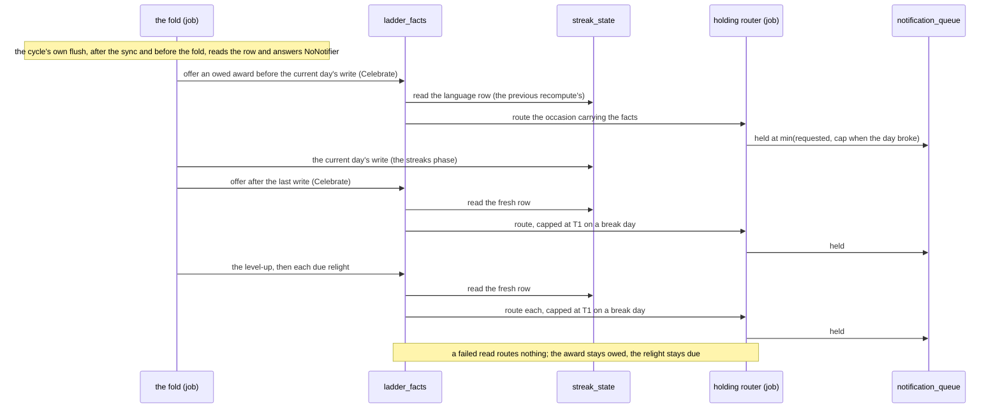
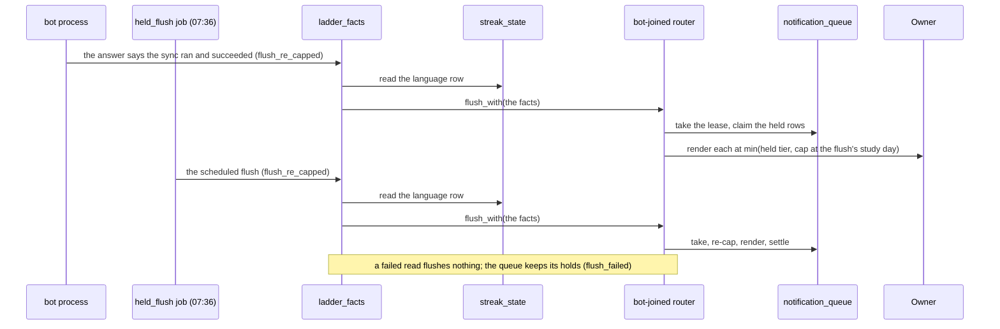

# Schematic: the celebrations read the stored streak

Kind: sequence. Read at DeckStreak `dev` `c6d29f73` (`crates/coordination/src/sync_cycle.rs`
`sync_cycle` and `flush`; `crates/coordination/src/recompute/mod.rs` `run`, `offer_owed` and the
`Celebrate` impl for `Router`; `crates/coordination/src/level_up.rs` `announce_level_up`;
`crates/coordination/src/relight.rs` `announce_relight`; `crates/coordination/src/held_flush.rs`
`perform`; `crates/daemon/src/sync_request.rs` `answer` and the `Flush` impl for `Arc<Router>`;
`crates/notifications/src/router.rs` `ladder_tier`, `flush_with` and `deliver`;
`crates/streaks/src/store.rs` `state`). Added by SPEC-326; decided by ADR-327.

## The actors and the shared row

- **The job process** runs the recompute cycle with a holding router (no bot transport,
  SPEC-319). Its fold writes `streak_state` for the current study day in the streaks phase.
- **`ladder_facts`** (coordination) is the one reader: `streak_facts(db)` reads the `language` row
  of `streak_state` on a reader connection of the router's own database (`Router::db`).
- **The bot process** flushes its bot-joined router after it observes the owner's request answered
  by a sync that ran and succeeded; **the `held_flush` job** flushes at 07:36.
- **`streak_state`** is the row the fold writes and every reader reads; **`notification_queue`**
  is the queue every flush takes under its lease.

## The cycle: each route reads the row, then routes to a hold

## The senders: each flush reads the row, then re-caps at its take

## What the models hold

The read is a read of `streak_state` before the route or the flush's take; it moves no variable of
`formal/tla/HeldFlush`, `formal/tla/AwardOnce` or `formal/tla/RelightOrder`, so it is a stuttering
step of each, named in each model's dated re-read note. Its error arm is RelightOrder's refusal
before routing, AwardOnce's router call with no answer (nothing claimed), and in HeldFlush a due
flush that returns before its take, which the model names as an abstraction (#589). The race of a
fold committing a break between a flusher's read and its render is named there too (#589).
