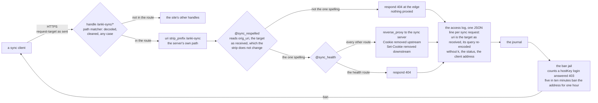
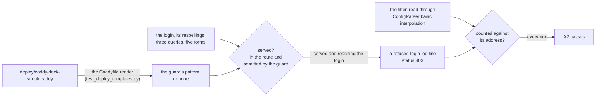

# Schematic: the sync route's one spelling at the edge, and the ban's population taken from it

Kind: data flow. Added by SPEC-351; ADR-362 decides it. Every `path:line` below was read at
DeckStreak `dev` 02a8e458, the base this delivery cuts from, and names the line a cure changes or
reads. It amends `docs/schematics/sync-server-hardening.md`'s data flow "The edge and the ban" with
a refusal branch inside the edge. That schematic's unit graph and offsite path are unchanged. Every
host step is the owner's go (#161).

## The edge and the ban, with the refusal branch (data flow)

The handle is `deploy/caddy/deck-streak.caddy:60` and the strip is `:63`. The guard is added
after `:63`: a four-line comment, the matcher and its `respond`. Caddy's directive order runs
`uri` before `respond` and `respond` before `reverse_proxy`. Two `respond` directives with named
matchers keep the order in which they appear, so the guard is judged before the health route. The
guard reads `{http.request.orig_uri}`, so where it falls in that order does not change what it
reads. The access log is `:23-36`. It records the request-target as the edge received it,
re-encoding only its query when it deletes `k`. The filter is
`deploy/fail2ban/filter.d/deck-streak-sync.conf:8` and the jail is
`deploy/fail2ban/jail.d/deck-streak-sync.conf`, both unchanged.

A refused spelling is answered 404, which the jail does not count. A served login is the one
spelling, in the origin form or the absolute form, with or without a query. The filter's existing
shape counts each of these when it is answered 403.

## The test's population (data flow)

With no guard in the block, the reader returns none. Every spelling the handle's matcher places in
the route then counts as served, which models the edge before this delivery. A1 reads the same
pattern. It asserts that every respelling of the route is refused, that every route of the server
in its one spelling is served, and that the pattern stays inside the part of RE2 that Python's
`re` reads alike.
