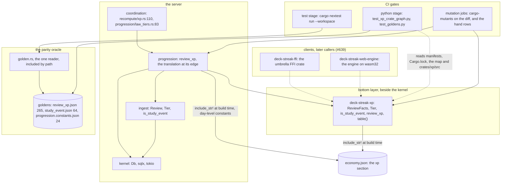
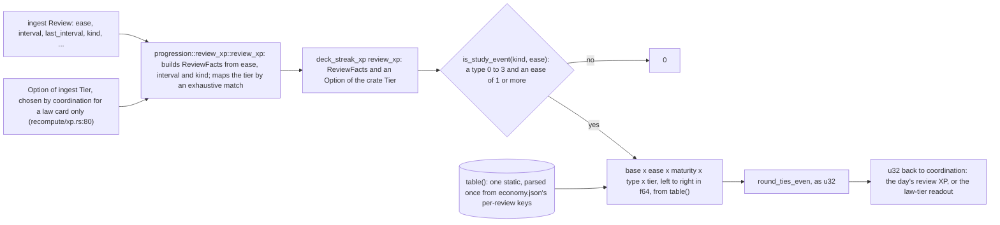
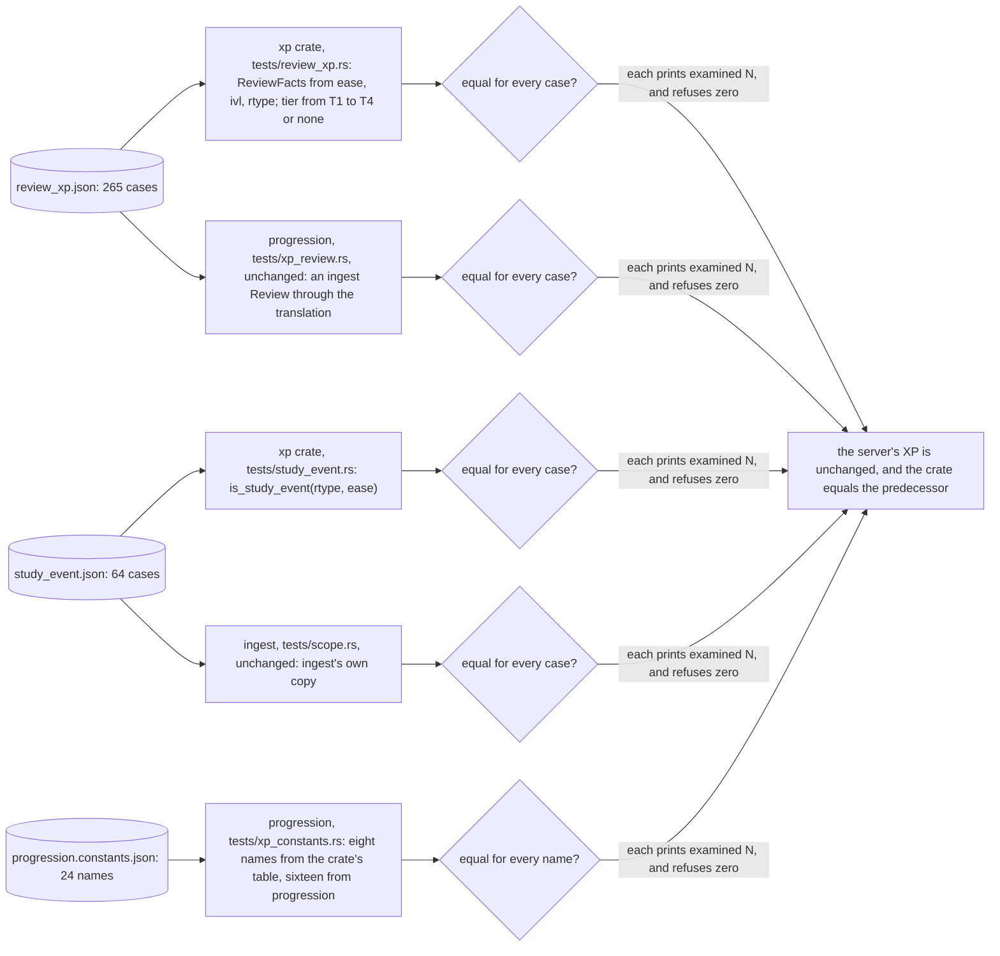
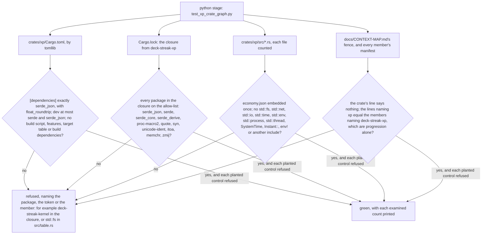

# Schematic: the I/O-free XP crate, its callers, the parity oracle and the census

Kind: component and data flow. Read at DeckStreak `dev` `b32a40b4` (`crates/progression/src/review_xp.rs`,
`crates/progression/src/economy_config.rs`, `crates/coordination/src/recompute/xp.rs`,
`crates/coordination/src/progression/law_tiers.rs`, `crates/progression/Cargo.toml`,
`crates/kernel/Cargo.toml`, `tools/parity-oracle/README.md`, `scripts/check.sh`,
`docs/CONTEXT-MAP.md`). Everything named `deck-streak-xp`, `ReviewFacts`, `ReviewXpTable`,
`table()` and `test_xp_crate_graph.py` is what SPEC-360 adds; everything else is on `dev` at
that commit. A solid arrow is a Cargo dependency, drawn by this delivery or already present; a
dashed arrow is an edge drawn later by #639.

## Components

The XP crate depends on nothing in the workspace, and its one external dependency is serde_json
with `float_roundtrip`. No arrow leaves it toward the kernel, ingest, an adapter or the engine.

## Flow 1: a review's XP, computed on the server through the crate

Coordination's call sites and their arguments do not change; only the body behind progression's
`review_xp` moves.

## Flow 2: the parity oracle compares both paths with the recorded vectors

No golden is regenerated and no registry module changes: the tests read the committed files.

## Flow 3: the census refuses an I/O dependency

A planted manifest, lockfile, source text and map are judged beside the real ones in each test, so
a census that went blind fails on its own controls.
