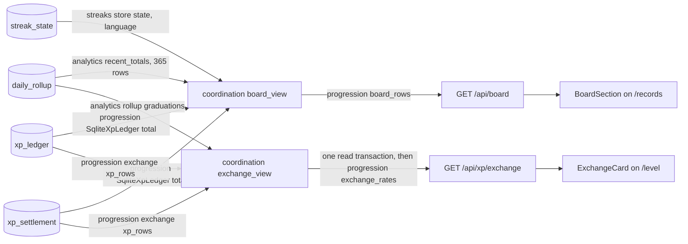
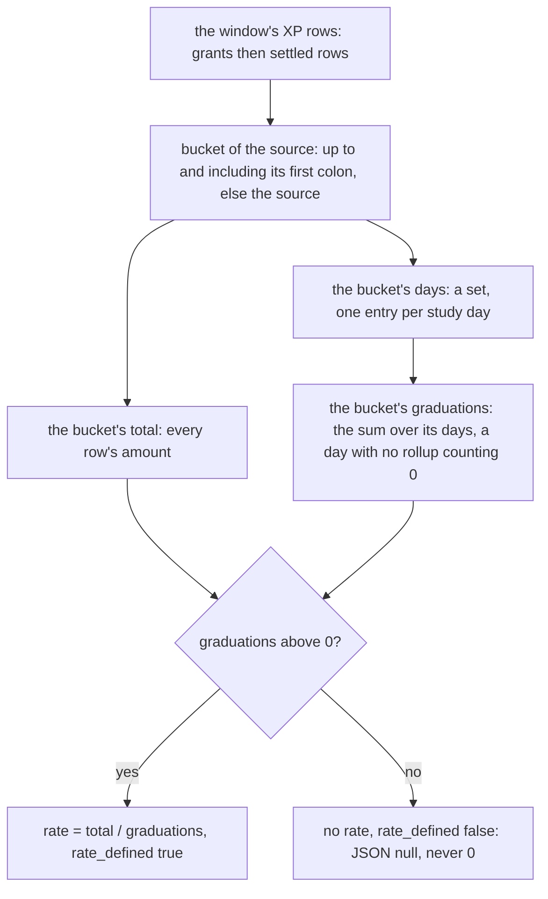
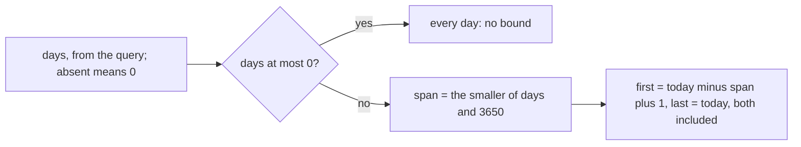

# Schematic: the personal board and the XP exchange readout

Kind: data flow. Read at DeckStreak `dev` a9d2b73 and at the predecessor's `27ee2bc`
(`pipeline_layers/read_api.py:ReadApiLayer.leaderboard`, `exchange.py:exchange_rates`,
`exchange.py:normalize_source`, `server.py:create_server`). Added by SPEC-075 (#79, #80); decided
by ADR-075. It extends, and does not change, `docs/schematics/data-flow.md`: both reads sit after
the recompute, which writes every table they read
(`docs/schematics/recompute-settles-each-study-day.md`).

## What each surface reads

- **The board** reads three things, each in one statement: the 365 most recent rollups on or before
  today (`deck_streak_analytics::rollup::recent_totals`), the language streak
  (`deck_streak_streaks::store::state`), and the XP total over both tables
  (`deck_streak_progression::ledger::SqliteXpLedger::total`, the number `GET /api/level` answers).
  Progression's pure `board::board_rows` orders them: Best day and Today when a rollup exists, then
  Streak, then Level. No row combines two reads, so the board takes no transaction.
- **The readout** reads three things on one read transaction (SPEC-075 R10): the grants and the
  settled rows of the window (progression's `exchange::xp_rows`, the only crate that may name both
  XP tables, ADR-072) and each day's graduations in the window (analytics' `rollup::graduations`).
  Coordination's `exchange_view` computes the window and joins them; progression's pure
  `exchange::exchange_rates` folds them into buckets.

## The readout's fold

Buckets are answered in byte order of their names. A source on both tracks is one bucket.

## The window

## What is not here

- No write. Neither read model writes a row, so the recompute is the only writer of every table
  above; the readout acts on nothing it read.
- No bot surface and no agent read tool (#157).
- No per-source multiplier: re-pricing future grants is #281's (#267).
