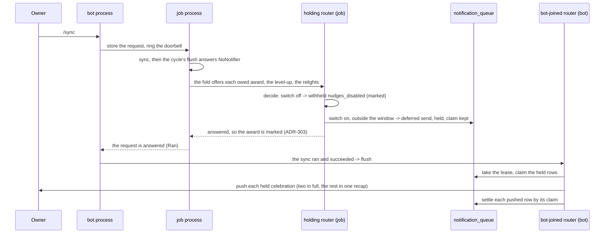
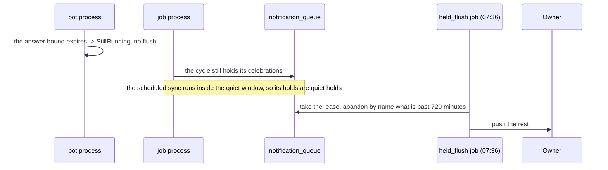

# Schematic: the recompute holds a router for the senders

Kind: sequence. Read at DeckStreak `dev` `6773f6e` (`crates/coordination/src/sync_cycle.rs`
`sync_cycle` and `flush`; `crates/daemon/src/wiring.rs` `RecomputeSetup` and `OwnerSyncCycle::run`;
`crates/daemon/src/role_job.rs` the scheduled sync and the `held_flush` job;
`crates/daemon/src/sync_request.rs` `answer`; `crates/notifications/src/router.rs` `decide`,
`after_claim` and `flush_with`). Added by SPEC-319; decided by ADR-319.

## The actors

- **The job process** runs both recompute cycles: the scheduled sync and the owner's sync when a
  request is stored (SPEC-059). Every cycle it builds goes through `RecomputeSetup::cycle`, which
  attaches a holding router: `Router::new(..).holding()`, with no bot transport. It loads no bot
  credential (ADR-066).
- **The bot process** stores the owner's request, rings the doorbell, polls for the answer within
  its bound, and flushes its own bot-joined router when the answer says a sync ran and succeeded.
- **The `held_flush` job** runs at 07:36, outside the quiet window, with its own bot-joined router
  (SPEC-041 R14, R17). It is the backstop for a hold no answer flushed.
- **`notification_queue`** is the shared state. Every flush takes it under the flush lease and
  claims each row it sends (SPEC-041 R16).

## The owner's sync, outside the quiet window

## When no answer is observed, and the scheduled sync

## What the model holds

`formal/tla/HeldFlush` models the hold as `HoldSend(i)`, enabled outside the window at a sync
trigger before the flush that follows the answer (`"sync" \notin fired`), and the expired answer as
`Unanswered`, which answers that trigger with no flush. `MCHeldSendHold.cfg` places a scheduled
trigger after the last sync trigger, as the next 07:36 always comes, and the witness
`a-hold-outside-the-window-with-no-later-flush.cfg` drops it: `HeldReachesOrAbandons` must then
find an item still held at the end of the run.
