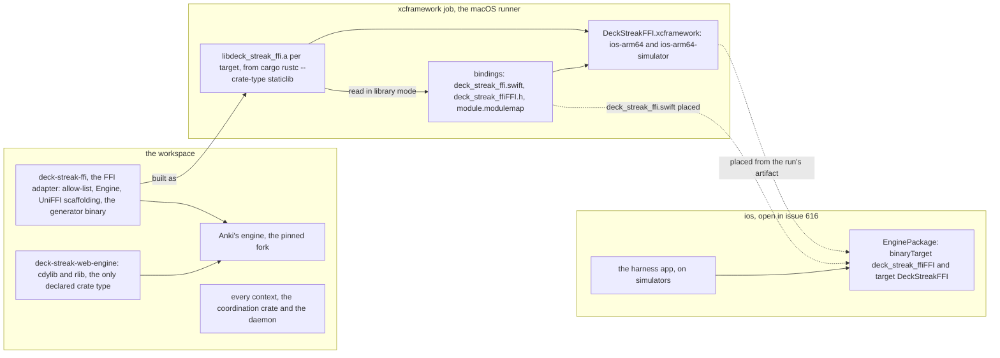
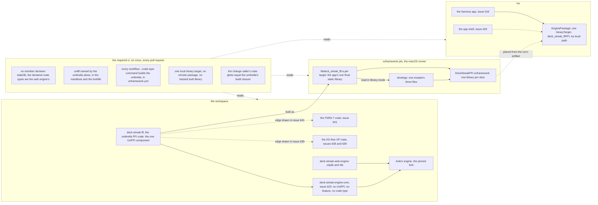
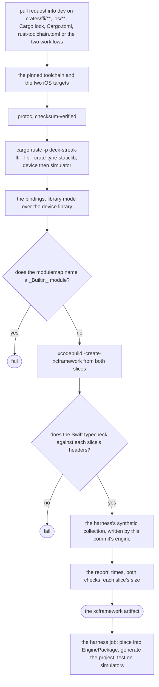
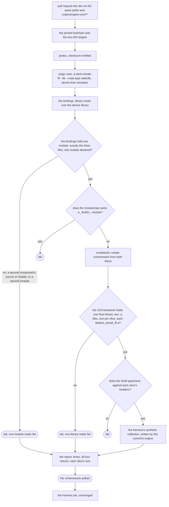
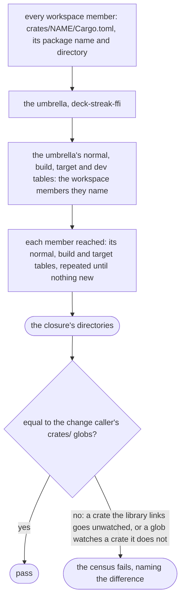

# Schematic: the umbrella FFI crate, the app's one static library, and the Swift package that wraps it

Kind: component (before and after), then the build's data flow (before and after), then the
closure the change caller follows. Read at DeckStreak `dev` `ccd36df611ed4ca32d239c5b557af52db243fa2c`
(`crates/ffi/Cargo.toml`, `crates/ffi/src/lib.rs`, `crates/web-engine/Cargo.toml`, `Cargo.toml`,
`Cargo.lock`, `.github/workflows/xcframework.yml`, `docs/CONTEXT-MAP.md`), with #656 at
`d295cd886a520ea61387723c0b081fed29a33c5d` (`ios/EnginePackage/Package.swift`, `ios/project.yml`,
`.gitignore`, its `xcframework.yml`) and #659 at `58d03e661a87c1d2e56ba184a7a7bc1e1864311b`
(`scripts/tests/test_ci_workflows.py`, SPEC-344), and #623's design for the engine core. Decided by
ADR-357; built by SPEC-346. Amends `ffi-adapter-xcframework-and-swift-package.md`, whose
Swift package is drawn dashed: it now exists.

## The components, before

At `dev`, with #656 and #659 open. The adapter depends on the engine alone (`crates/ffi/Cargo.toml`
lines 14 to 19), declares no crate type, and its static library is made by one workflow command
(`xcframework.yml` line 65). The Swift package is #656's (`ios/EnginePackage/Package.swift` line
14). Nothing counts the static libraries or the UniFFI components that enter the app.

## The components, after

The adapter is the umbrella FFI crate, grown in place (ADR-357 D1). It depends on the engine core
(#623), and the XP crate and the FSRS-7 crate join it by edges drawn in #639 and #641 (dashed: not
built by this delivery). UniFFI is named by the umbrella alone (D2). The required CI's census and
the macOS job's two new steps hold one library and one component (D3).

No arrow joins a context to the umbrella or to the core: the core's graph test (#623) refuses a
member naming either adapter, and the map's line for the umbrella keeps `depends on: engine-core`.

## The build, before

`apple-on-change.yml` (#659) calls the one job body on a pull request into `dev` touching its paths.

A change to `crates/engine-core/**` alone, once #623 lands, starts nothing here, though it changes
the library.

## The build, after

Two steps join the job, each after the step whose output it reads, and each writes `pass` or `fail`
to the report before it exits. Both use POSIX tools only, so a Linux test runs each step's own
script over planted trees (SPEC-346 A6, A7).

## The closure the change caller follows

A dependency on a non-member (the engine, UniFFI) is outside the workspace and is watched through
`Cargo.lock` and `Cargo.toml`, which are already among the paths.
