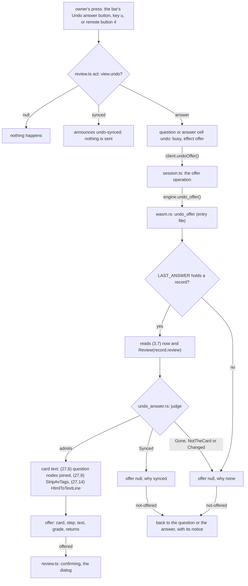
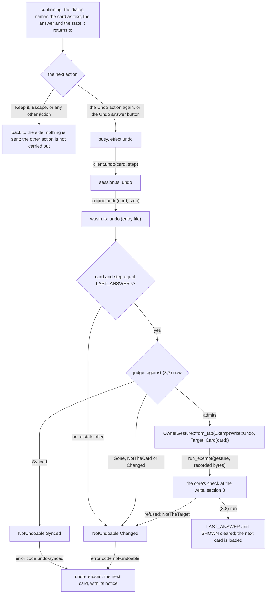
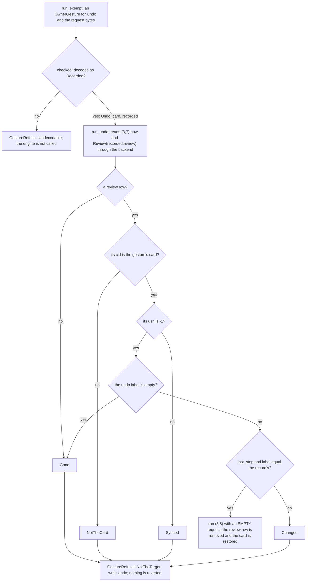

# Schematic: from the press to the confirmed undo, and every refused path (SPEC-371)

Kind: **data flow** for the offer, the confirmation and the check at the write; a **state machine**
for the review; and a **component** view of the doors before and after. Every `path:line` was read
at DeckStreak `dev` `2438c4c6`, which holds SPEC-365 and SPEC-366. Names after this delivery are
those SPEC-371 R1 to R15 give.

## 1. The press asks for an offer

The empty queue is one of `judge`'s `Gone` arms: after a normal sync, or when nothing was
answered, the engine's undo label is empty and no offer is made.

## 2. The confirmation reaches the write

While the dialog asks, the focus is on "Keep it", and the page's key reader leaves a key aimed at a
button to that button, so key `u` does not confirm: the keyboard confirms through the dialog's "Undo
answer" button, and remote button 4 confirms from the answer side; on the question side the remote's
reader resolves no key but show answer, so there the bar's "Undo answer" button asks for the offer.

## 3. The check at the write, in the core

## 4. The review's states

```mermaid
stateDiagram-v2
  state "question or answer" as side
  state "busy, effect offer" as asking
  state "confirming" as confirming
  state "busy, effect undo" as writing
  state "next card" as next
  side --> asking: undo, when view.undo is answer
  side --> side: undo, when view.undo is synced or null; nothing sent
  asking --> confirming: offered
  asking --> side: not-offered, with its notice
  confirming --> writing: undo, or the Undo answer button
  confirming --> side: keep, Escape, or any other action, not carried out
  writing --> next: the undo is made
  writing --> next: undo-refused, with its notice
```

No cell answers in either busy state, so a press while the offer loads, or while the write runs,
does nothing. A key repeat is dropped before it reaches the machine (`keys.ts:47`). The done state
holds no cell (`review.ts:59`), so it offers no undo.

## 5. Who can reach Undo (3,8)

| door | at `dev` `2438c4c6` | after SPEC-371 |
|---|---|---|
| the core's `run` (`dispatch.rs:122-141`) | admits (3,8) on both transports (`table.rs:144-150`) | refuses `NeedsGesture` |
| the native `run` | admits it (`allow_list.rs:61-65`) | refuses `EngineRefusal::NotAllowed { 3, 8 }` at the allow-list |
| the web `run_method` (`wasm.rs:650`) | admits it (`study.rs:82`) | refuses: not a study call, and the core refuses it too |
| the web `run_exempt` export (`wasm.rs:272-289`) | indices 0 to 5, no Undo | unchanged: 0 to 5, no Undo |
| the web `undo` (`wasm.rs:252-259`) | runs (3,8) unchecked, on the press | `undo(card, step)`: only after an offer and a confirmation, through the gesture, checked at the write |
| the web `undo_offer` | absent | reads and judges; writes nothing |
| `Dispatcher::run_exempt`'s `Undo` arm | absent | the one door to (3,8), which needs an `OwnerGesture` minted for Undo |
| any other caller of the name `undo` outside the core | the bot's habit undo (`commands.rs:657`), the bot router's literal (`one_router.rs:670`), three ingest fixture lines | held by name in the census, with their reasons; a new one is refused by name |

The gesture for Undo is minted only in `wasm.rs`'s `undo`. The Rust census
(`crates/engine-core/tests/containment.rs`) holds that, and the page's census
(`web/app/src/lib/study/undo-reach.test.ts`) holds `.undo(` to the review and the session, the
offer to one call each, and the `undo` effect to `confirming`.

## 6. What carries state

- `LAST_ANSWER` (new, `wasm.rs`): the review's own last answer, its card, its grade, the state it
  left and the engine's undo status when it was made. `rate` writes it after `run_answer`, only
  when the newest review's card is the rated card. `current_card`, `undo_offer` and `undo` read it.
  A successful undo, `open` and `close` clear it. It lives only on the Worker's one thread, beside
  the four `thread_local!` items the web engine holds today (`wasm.rs:66-72`).
- `SHOWN` (`wasm.rs`): the kept card, unchanged by this delivery. A successful undo clears it, as
  today.
- The engine's undo queue: every begun operation advances its step, and a normal sync discards it.
  It is read through (3,7) at the offer and again at the write. Between the two, the learner, the
  review's other controls and a future web sync can each change it, which is why `judge` runs at
  the write and why the model `formal/tla/UndoOwnAnswer` covers `judge`, `run_undo`, `undo`,
  `undo_offer` and `rate`.
- The offer on the page: the card and the step it was shown, carried back in the confirmation for
  the Worker to compare with its record.
- `OwnerGesture`: minted in `undo` and consumed by `run_exempt` in the same call. It is never
  stored.
