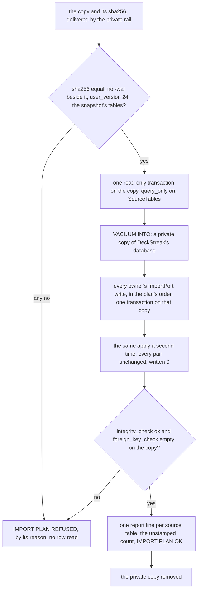
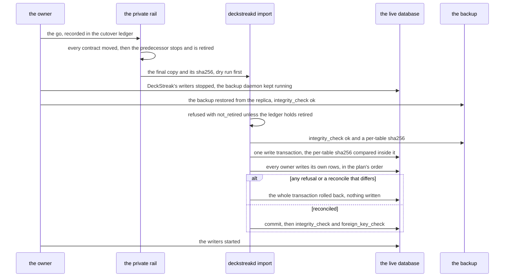
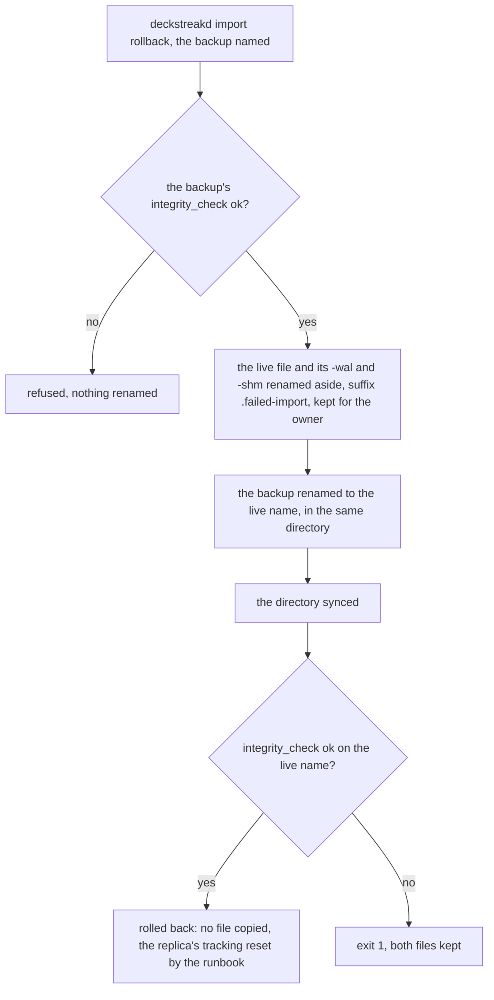

# Schematic: the v9 import, from a verified copy to one apply and its way back

Kind: data flow and sequence. Read at DeckStreak `dev` (ADR-008, ADR-011, SPEC-020, SPEC-021,
docs/schematics/data-flow.md, docs/schematics/data-rights-export-and-erase.md,
docs/schematics/deployment.md) and at the predecessor's `27ee2bc` (its store's schema at
`user_version` 24, and the functions SPEC-140 §7 and SPEC-141 §7 prove). Added by the W8 plan for
SPEC-140, SPEC-141 and SPEC-142; ADR-140, ADR-141 and ADR-142 decide it. The import reads a COPY,
never the predecessor's live file: the private rail (#41) delivers the copy and its digest, and
nothing in the repository names where the predecessor keeps its database.

## The dry run, as often as the owner likes

It writes nothing live, so it runs side by side (#62), before the owner's go.

## The apply, once, after the go and the retirement (#164)

## The rollback, by rename

## Who writes which rows

Each context writes its own rows through its own `ImportPort` (ADR-140): the migration crate
composes the ports and owns no table. A row the predecessor never recorded arrives NULL, never
invented (SPEC-140 R7), and a recovered card-state reading keeps its origin (ADR-141). The
reconcile judges each source table under the census's rule (`equal`, `filtered`, `sum`,
`declared`), and a table the plan drops is dropped with its reason (SPEC-142 R3).
