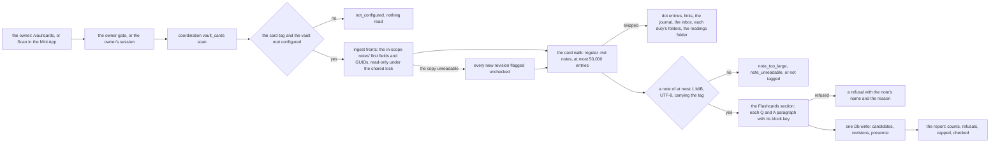
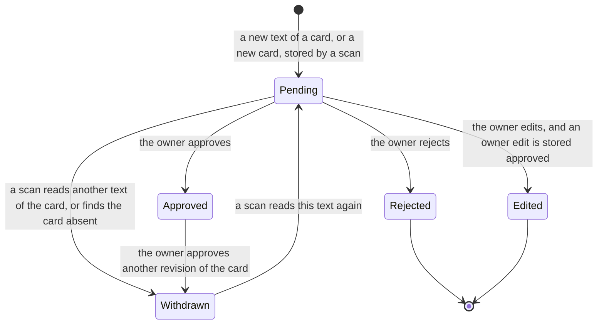
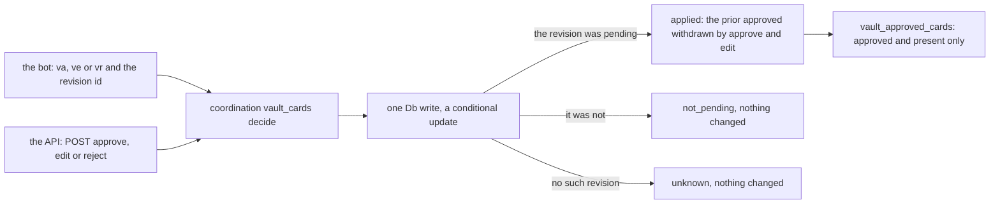

# Schematic: a vault card, from the owner's tagged note to an approved candidate

Kind: data flow and state machine. Read at DeckStreak `dev` a4036b3 (ADR-006, ADR-011, ADR-116,
ADR-118, `docs/schematics/data-flow.md`, `docs/schematics/vault-write-paths.md`,
`docs/schematics/bot-update-loop.md`, `docs/schematics/owner-session.md`,
`docs/schematics/data-rights-export-and-erase.md`). Added by SPEC-150 (ADR-150, ADR-152). It adds to
`data-flow.md` one read of the vault (the card walk) and one read of the collection's copy (the plain
fronts); it adds no path to `vault-write-paths.md`, because this feature writes nothing into the
vault, and it rewrites neither.

## The scan

The walk and the fronts are reads; only the store step writes, and it writes DeckStreak's own two
tables. A capped walk stores what it read and marks nothing absent.

## A revision's states

`Rejected` and `Edited` are final for their text: the migration's trigger refuses any move out of
them, and a scan that reads that text again adds nothing. An owner edit is stored `Approved` and can
only become `Withdrawn`. One `Pending` and one `Approved` revision at most per candidate, each held by
a partial unique index.

## The decision

Both surfaces reach the store through the one use case (ADR-152), so two decisions of one revision at
once apply one. The view is what SPEC-151's package reads, and nothing else is read for it.

## Data rights

Both tables are declared by the vault's data-rights port and exported and erased with the owner's
data (`data-rights-export-and-erase.md`). An erase deletes these rows and never a note (ADR-118); a
card the owner has already imported into Anki is the owner's and no erase reaches it.
