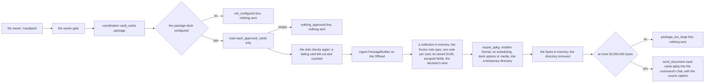
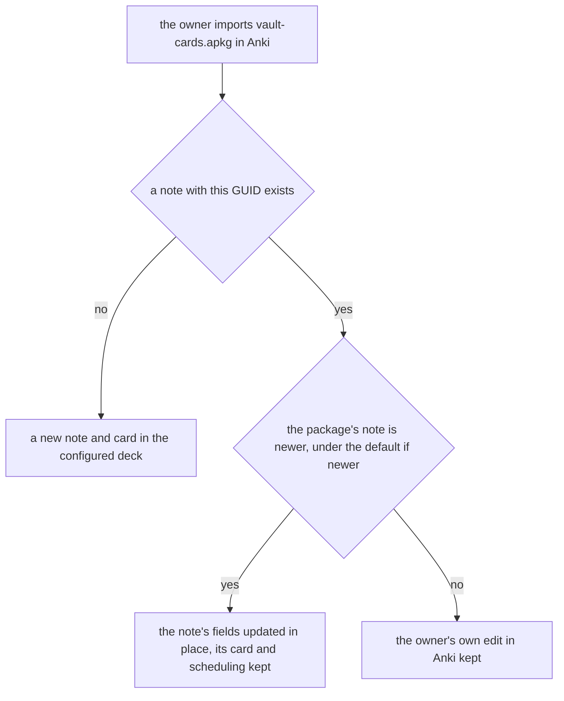

# Schematic: the vault-card package, from the approved cards to the owner's chat

Kind: data flow. Read at DeckStreak `dev` a4036b3 (ADR-006, ADR-009, ADR-058,
`docs/schematics/data-flow.md`, `docs/schematics/engine-pin-lifecycle.md`,
`docs/schematics/bot-update-loop.md`, `docs/schematics/notification-router.md`), and at the engine's
pinned fork `57382da` for the export and the importer it relies on. Added by SPEC-151 (ADR-151,
ADR-152), after SPEC-150's `vault-card-candidate-lifecycle.md`. It adds to `data-flow.md` one
outbound file, sent as a command reply; it adds no write to the owner's collection or its copy, and
it rewrites no accepted schematic.

## The build and the send

The package exists in memory and in that one document. No route of the API serves it, no job builds
it, and the log lines along this path carry counts and outcome words only.

## What the owner's import does

Each note's time is the owner's decision (ADR-151), so a package re-sent without a new decision never
overwrites an edit the owner made in Anki, and an approved edit does update the note. The import is
the owner's act; DeckStreak writes no Anki collection but the in-memory one it builds the file from.
