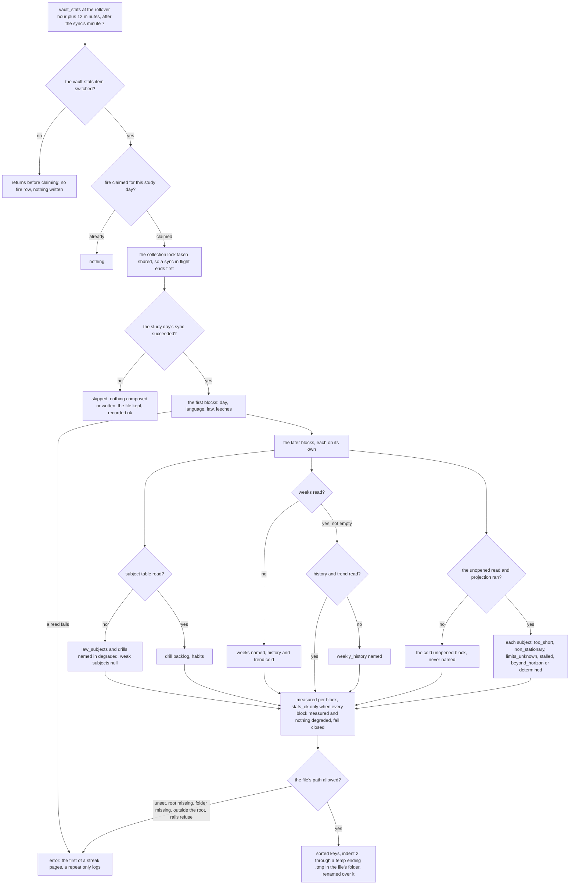

# Schematic: the nightly stats file, after the day's one sync, by one writer

Kind: data flow. Read at DeckStreak `dev` (ADR-011, ADR-027, ADR-037,
docs/schematics/cron-fire-ledger-and-catch-up.md, docs/schematics/vault-write-paths.md,
docs/schematics/sync-cycle-and-change-gate.md) and at the predecessor's `27ee2bc`
(`vault_bridge.py:build_vault_stats`, `_apply_degradation_signal`, `write_vault_stats`,
`unopened.py:read_unopened_rows`, `build_report`). Added by the W8 plan for SPEC-146; ADR-146
decides the slot. The job never syncs: it reads the study day's sync outcome (ADR-037), and it
writes nothing until its checklist item switches (SPEC-143).

The unopened read is ingest's: a read-only read of the copy inside the owner's scope, five sets,
and an unreadable copy is an error rather than an empty read. The projection is analytics', pure.
The composition, the degradation signal and the job are coordination's; the file's contract is
the vault's.
