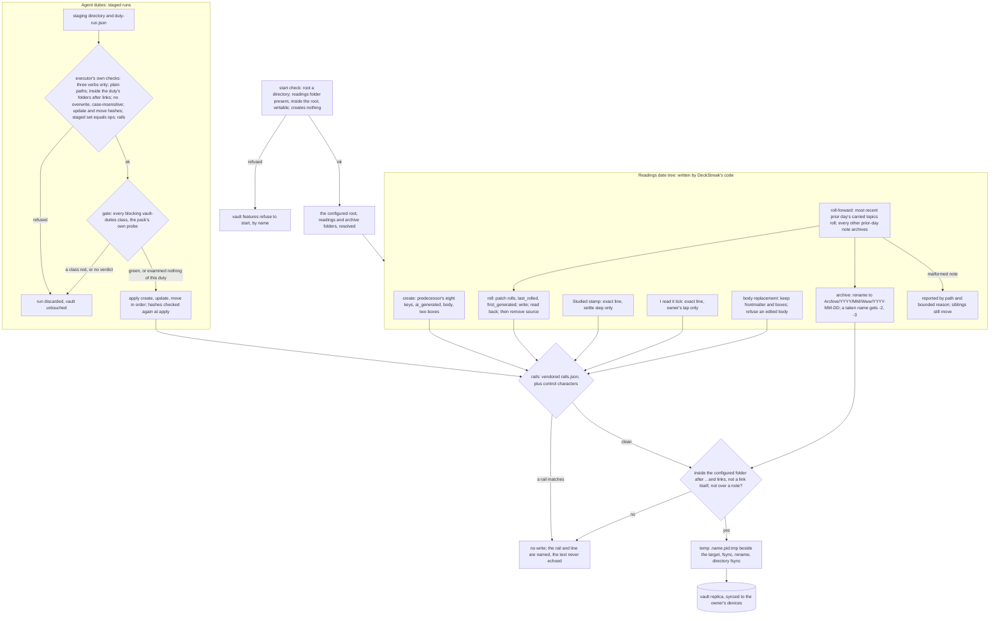

# Schematic: the vault adapter's two write paths

Kind: data flow. Read at DeckStreak `main` ce3683d (ADR-011, ADR-019, docs/schematics/data-flow.md),
at the predecessor's `27ee2bc` (`reading_notes.py`: `_atomic_write`, `_roll_note_text`,
`_move_with_roll`, `_archive_dir`, `roll_forward`, `stamp_studied`), and at the vault-duties pack as
vendored (its probe's `no-executable`, `write-confinement` and `never-deletes` classes, `rails.json`,
the run record and the three-verb grammar). Added by SPEC-042, and drawn again at its delivery with
the start check, the staged run's own checks before its gate, and the archive's numbered names
(ADR-042).

| guard | where it holds | proved by |
|---|---|---|
| never a top-level folder | the start check; the executor refuses a missing top-level folder | SPEC-042 A11 |
| a temp name the bridge ignores | every write | SPEC-042 A1 |
| the rails | every byte written | SPEC-042 A2 and A3 |
| no overwrite, no delete | create, roll, archive, executor | SPEC-042 A8, A10 |
| nothing outside its folder | every write, after `..` and symbolic links | SPEC-042 A8 |
| the roll's bytes | the roll, proved against the predecessor | SPEC-042 A4, A5 |
| a roll-forward is idempotent | the roll-forward | SPEC-042 A7 |
| the owner's tick | only the tap writes it; nothing unticks | SPEC-042 A12, SPEC-047 A2 |
| the owner's edits | the body replacement | SPEC-042 A13 |
| one writer of the readings folder | the archive switch stays off until the predecessor's job is disabled | SPEC-053 A9 |
