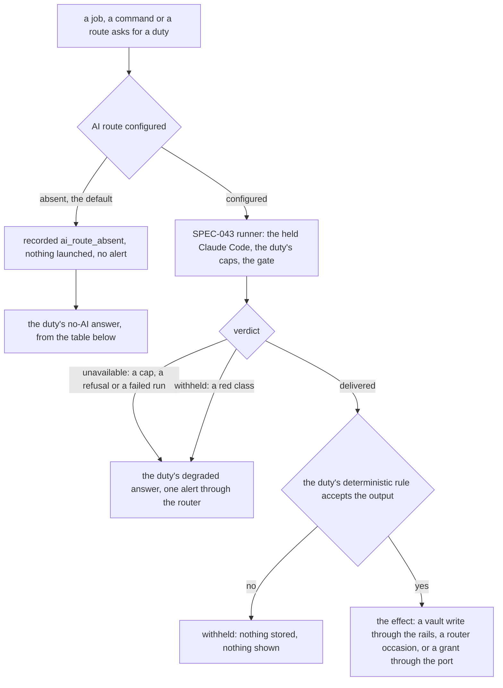

# Schematic: a W6 duty run, and what each duty does when it cannot run

Kind: decision flow and table. Read at DeckStreak `dev` 5216bcf (ADR-015, ADR-043, ADR-054,
ADR-063, `docs/schematics/agent-duty-run.md`, `docs/schematics/notification-router.md`,
`docs/schematics/vault-write-paths.md`, `docs/schematics/xp-grant-port.md`). Added by SPEC-111 to
SPEC-117 (ADR-111 to ADR-117). It adds nothing to the run itself: every W6 duty is one call of
SPEC-043's runner, drawn in `agent-duty-run.md`, and every message it sends is one occasion of the
router drawn in `notification-router.md`. What it adds is the decision around the run: the
deterministic rule that must accept a model's output, and the product's answer when the run is
skipped, withheld or unavailable.

## Around every run

No branch touches a review, a streak or a grant that does not depend on the duty: a duty that
cannot run leaves the rest of the product as it was.

## Each duty

| duty | SPEC | what the model makes | the rule that must accept it | with no AI route |
|---|---|---|---|---|
| drill mint and grade | SPEC-111 | a drill note, a grade | the law gate, integer scores 0 to 10, the engine's XP formula | archive only, nothing minted or graded |
| leech doctor | SPEC-112 | a remedy for a failing card | a confusable among the candidates, a mnemonic of 40 words at most | "not enabled", the card's protocol stays |
| writing tutor | SPEC-113 | a correction of a sample | each correction parses, three categories at most, a next step present | "not enabled", the sample still counts for the habit |
| conversation partner | SPEC-113 | one reply | the gate's classes: one turn, the level's ratio, the notation | "not enabled", no turn stored |
| practice set | SPEC-114 | a set of items | each key among its choices, unique ids, no official item | "not enabled", a stored set still pays |
| digest coaching | SPEC-115 | one paragraph | quotes only the digest's own numbers | the digest goes out with no coaching line |
| inbox curator | SPEC-116 | a filing plan | ids in the snapshot, destinations in the layout, bytes unchanged | nothing filed, captures wait |
| weekly synthesis | SPEC-116 | a cited note | every claim cites a note of the week | nothing written |
| daily note | SPEC-116 | nothing, it needs no model | the layout's template | written as usual |
| vault pass | SPEC-117 | nothing itself, it runs the three above | one pass at a time, bounded | completes and writes the daily note |

Every message a duty sends (the drill's ready line, the curator's count, the digest) is an occasion
of the one router, under its tiers, budgets and quiet hours; no duty holds a second delivery path.
