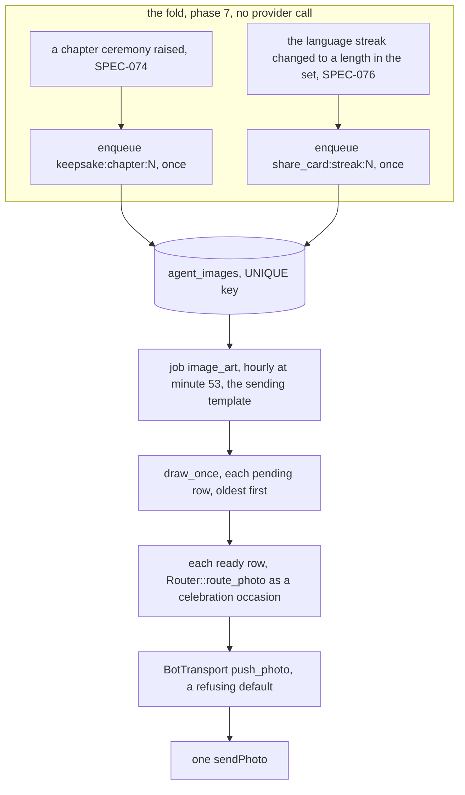
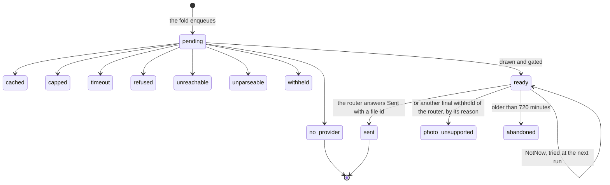
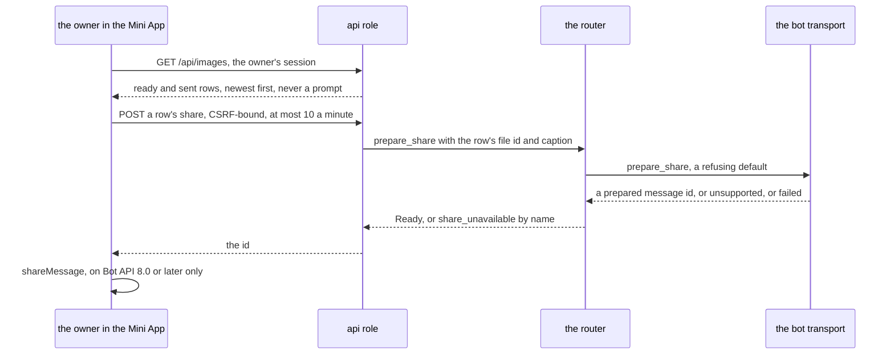

# Schematic: the W7 image pipeline, and the product with no image provider

Kind: data flow, state machine and table. Read at DeckStreak `dev` 026d1f3 (ADR-041, ADR-054,
ADR-067, `docs/schematics/notification-router.md`, `docs/schematics/celebration-ladder-on-the-router.md`,
`docs/schematics/agent-duty-run.md`, `docs/schematics/recompute-settles-each-study-day.md`,
`docs/schematics/data-rights-export-and-erase.md`). Added by the W7 architect turn for SPEC-132,
SPEC-135 and SPEC-136 (ADR-135, ADR-136). It rewrites none of them: the fold only enqueues, the
router of `notification-router.md` sends every photo, and the agent's output gate of
`agent-duty-run.md` judges every image. No provider is wired: the product drawn here is the one
that runs until the owner's choice (#169) is delivered.

## From a milestone to a photo



A key already present enqueues nothing, so a streak length reached again after a lapse draws no
second card, and a replayed fold draws nothing twice. No ceremony, streak, grant or fold step reads
`agent_images`: a provider's failure, timeout or absence changes none of them.

## One draw, one outcome

```mermaid
flowchart TD
  p["a pending row"] --> o1{"provider wired"}
  o1 -->|no, the default| np["no_provider, no call"]
  o1 -->|yes| o2{"an image already held for the key"}
  o2 -->|yes| ca["cached, no call, nothing counted"]
  o2 -->|no| o3{"the study day's cap reached, shared by both kinds"}
  o3 -->|yes| cp["capped, no call"]
  o3 -->|no| cnt["the draw is counted on the study day, in its own write"]
  cnt --> call["the provider's call, bounded at 90 s"]
  call -->|no answer in time| to["timeout"]
  call -->|a refusal| rf["refused"]
  call -->|no answer| un["unreachable"]
  call -->|no image in the answer| up["unparseable"]
  call -->|an image| gate{"the output gate, the task's classes"}
  gate -->|a class fails| wh["withheld, the image discarded"]
  gate -->|every class passes| rd["ready, the image stored"]
```

Every outcome is final: a row is drawn once. The study day is the kernel's, which turns over at 04:00
local.

## A row's life



## Sharing a drawn image



The owner sends a share from Telegram's own sheet (ADR-136): DeckStreak never posts to a chat the
owner did not choose.

## The product with no image provider

| surface | with no provider | with a provider |
|---|---|---|
| a chapter ceremony | the text ceremony alone: no photo, no error, no placeholder | the text ceremony, then the keepsake photo at the job's next run |
| a streak milestone | nothing sent and no error; the milestone's own celebration unchanged | a share card photo, once per length |
| the gallery | its empty state, which says that no art has been drawn | each ready or sent image, labelled as AI-generated art |
| the cap, the gate, the log | no call, so nothing counted, gated or logged beyond the key and `no_provider` | two draws a study day, every image gated, the key and outcome logged |

The provider's credential is loaded only through the kernel's credential loader: missing means
off, empty refuses the role's start by its id, and no unit names it until #169's delivery binds it.
