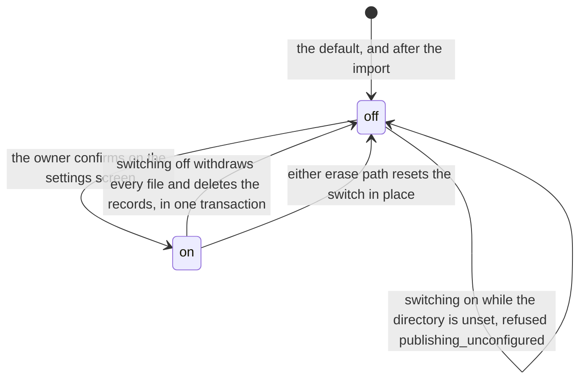
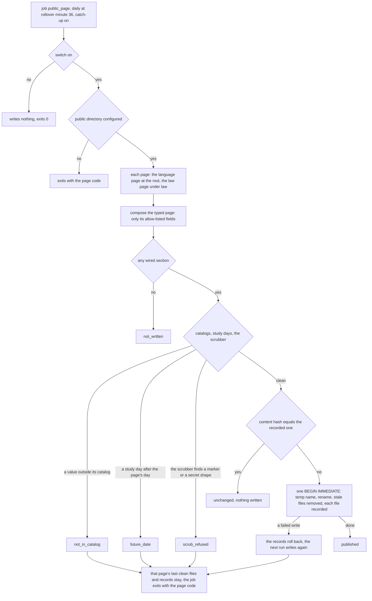
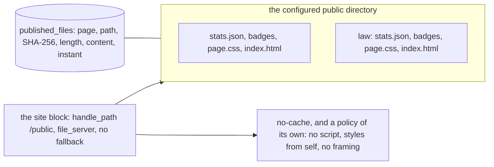
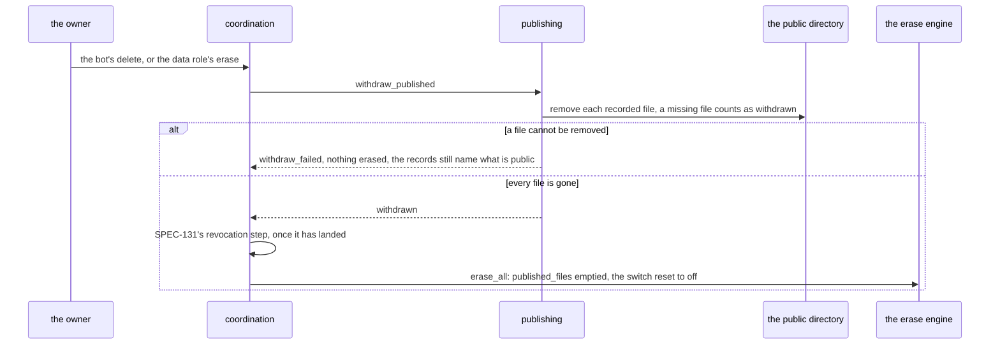

# Schematic: publishing the achievement page, and withdrawing it

Kind: state machine, data flow and sequence. Read at DeckStreak `dev` 026d1f3 (ADR-012, ADR-027,
ADR-059, `docs/schematics/cron-fire-ledger-and-catch-up.md`,
`docs/schematics/data-rights-export-and-erase.md`, `docs/schematics/deployment.md`,
`docs/schematics/first-deploy-and-gates.md`). Added by the W7 architect turn for SPEC-137
(ADR-137) and SPEC-130's settings screen (ADR-130). It rewrites none of them: the job is one row of
the cron-fire ledger, and the erase keeps the engine drawn in `data-rights-export-and-erase.md`,
with the withdrawal as its first step. DeckStreak serves the page itself from a directory the owner
configures, so a withdrawal is a file removal on its own host and nothing public outlives it.

## The switch

The screen names, before the owner confirms, what becomes public (the wired sections of the typed
page) and what never does (the named drops). No bot command publishes or unpublishes.

## One run of the job

A refusal of one page never stops the other page. A second run on the same study day writes
nothing, because the hash is unchanged. `POST /api/publishing/run` runs the same composition and
write at once for the owner, and answers each page's outcome by name.

## What is written, and where it is served

Files are written `0644` in `0755` directories whatever the unit's umask. A page holds no script,
no inline style, no form and no resource from another origin. A withdrawn file answers 404, since
the handle has no fallback. A page recorded under a directory the configuration no longer names is
withdrawn from that directory before it is written under the new one.

## The unpublish: switching off, and the erase

Export holds each published file's bytes as written, with its path and instant, and the switch;
erase empties what export lists, so export and erase stay symmetric (SPEC-021).
