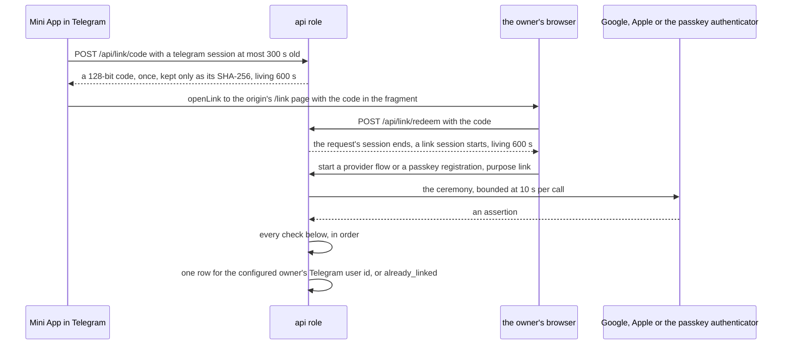
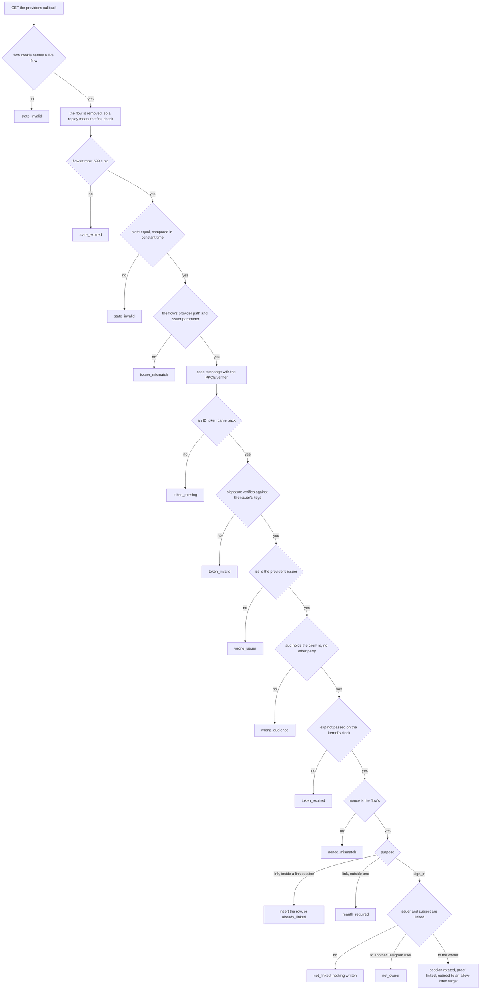
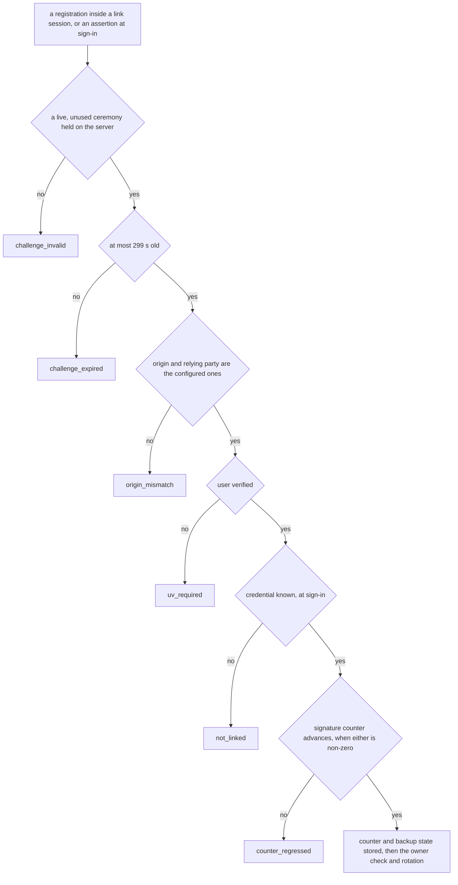
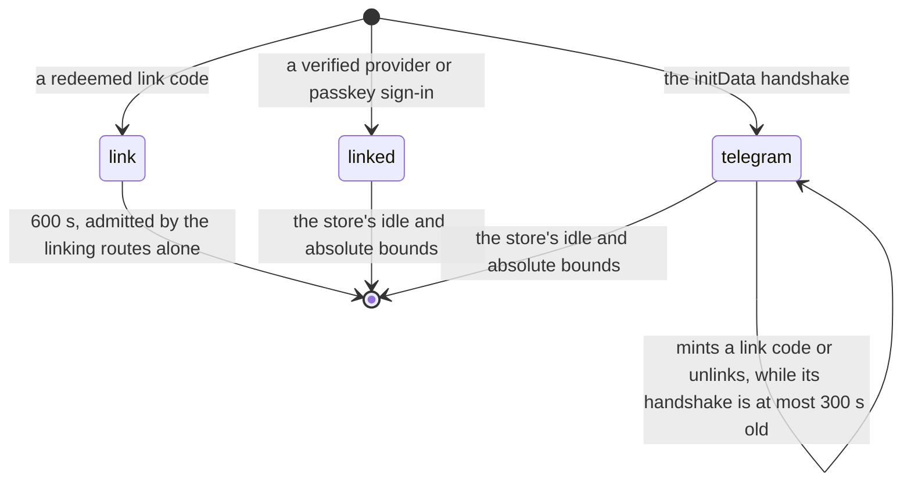
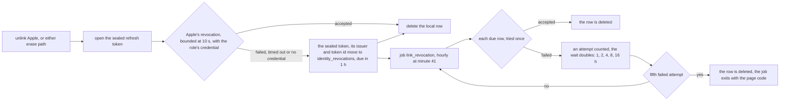

# Schematic: linked sign-in, from the link code to each refusal

Kind: sequence, decision flow and state machine. Read at DeckStreak `dev` 026d1f3 (ADR-006,
ADR-024, `docs/schematics/owner-session.md`, `docs/schematics/initdata-auth-sequence.md`,
`docs/schematics/data-rights-export-and-erase.md`, `docs/schematics/cron-fire-ledger-and-catch-up.md`).
Added by the W7 architect turn for SPEC-131 (ADR-131, ADR-132, ADR-133). It rewrites none of them:
the Telegram handshake of `initdata-auth-sequence.md` and the session store of `owner-session.md`
stand as drawn. What it adds is the second way in, and every point where a doubtful assertion is
refused. The identity model's declaration is SPEC-131's delivery (`docs/auth/identity-model.md`),
written when the methods ship, so this schematic declares nothing.

## The link: a fresh Telegram session hands a one-time code to the browser

No route creates an account: a link attaches to the owner's Telegram identity or is refused. The
email claim is never read, so no identity is joined by email.

## The OpenID Connect callback: ten refusals, in order

The start route admits `provider` from `google` and `apple` only (`provider_unknown`) and
`return_to` from `/` and `/settings` only (`redirect_refused`). Each refusal consumes nothing but
the flow.

## The passkey ceremony

## What each session proof admits

| proof | owner routes | mint a link code | unlink | linking routes |
|---|---|---|---|---|
| `telegram` | yes | yes, at most 300 s after its handshake | yes, at most 300 s after its handshake | yes |
| `link` | no | no | no | yes |
| `linked` | yes | no (`reauth_required`) | no (`reauth_required`) | no |

A linked identity never grants the owner's gate by itself: the sign-in reaches `linked` only when
the stored row's Telegram user id is the configured owner's.

## Unlink and erase: Apple's token is withdrawn at Apple first

A queued row never blocks an unlink, a sign-in or an erase. The erase order is the one
`data-rights-export-and-erase.md` draws, with the revocation step before the engine: when SPEC-137
has landed, its withdrawal of the public page runs first (`w7-publishing-and-unpublishing.md`).

## With no configuration

| missing | what happens |
|---|---|
| the public origin | every linking route answers 404 `linking_off`; Telegram's handshake is unchanged |
| a provider's credential, or the credentials directory | that provider answers `provider_off`; the others work |
| the token key or Apple's signing key in an erasing role | Apple's revocation is queued, never skipped |
| an empty credential | the role refuses to start, by the credential's id (ADR-067) |
