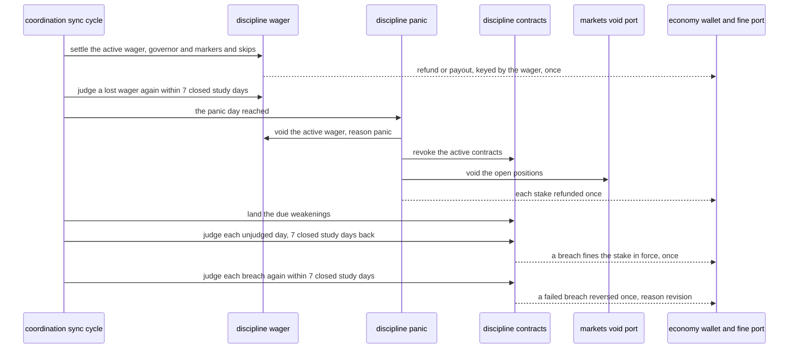
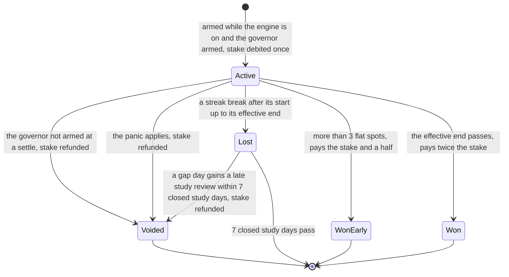
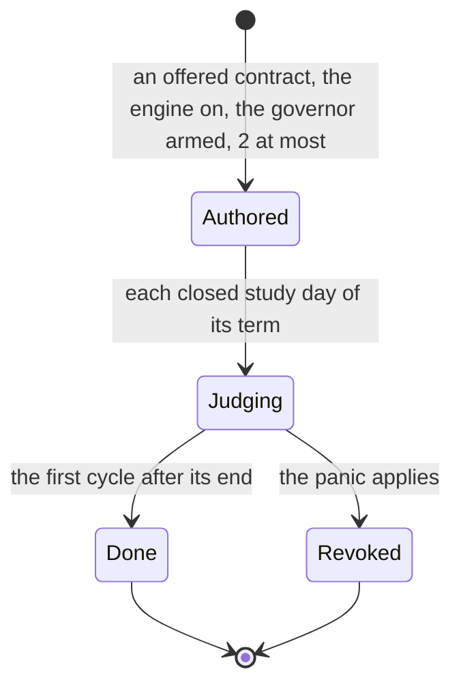
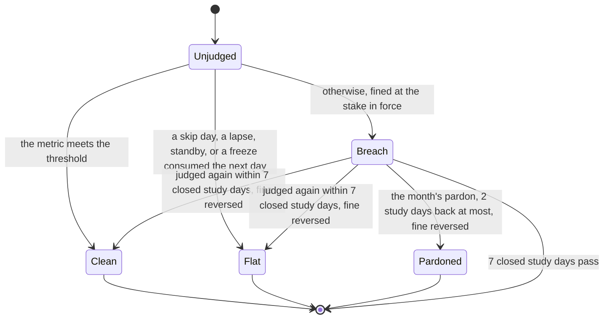
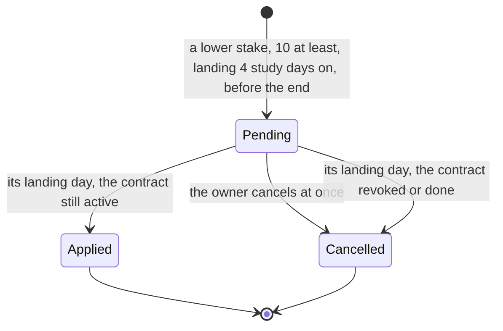
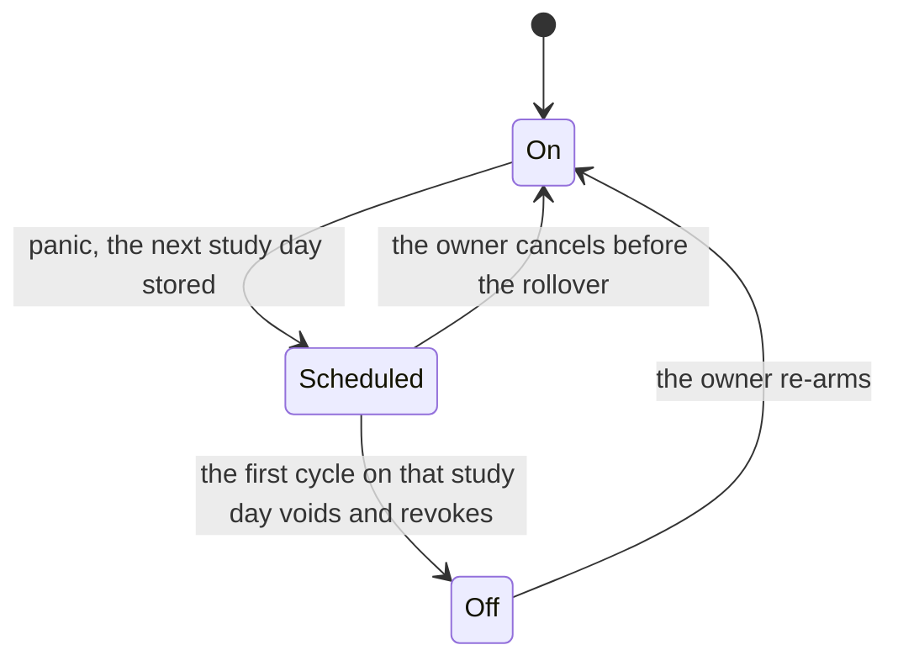

# Schematic: a wager's life, a contract's days, a weakening's horizon and the panic

Kind: state machine and sequence. Read at DeckStreak `dev` 26263de and at the predecessor's
`27ee2bc` (`pipeline_layers/discipline.py:DisciplineLayer`'s `arm_wager`, `_settle_wagers`,
`build_contract`, `_contract_verdict`, `_settle_contracts`, `queue_contract_weakening`,
`_apply_contract_changes`, `pardon_latest_breach`, `panic`, `_apply_panic` and
`_sunday_stake_review`, and `database.py:GamifyStore.stake_override_for_day`). Added by the W5
architect turn, under ADR-104 (a verdict is provisional until its evidence settles), ADR-105 (the
discipline tick) and ADR-106 (the money rung waits for the owner). SPEC-106 builds it.

It extends four accepted schematics without changing them:
`docs/schematics/sync-cycle-and-change-gate.md` (the cycle whose stakes step this is),
`docs/schematics/streaks-and-governor-state-machine.md` (the governor that licenses a stake, and the
freeze markers a wager reads), `docs/schematics/notification-router.md` (quiet hours withhold a
nudge) and `docs/schematics/celebration-ladder-on-the-router.md` (a won wager and a finished
contract celebrate). A breach's fine and its refund are
`docs/schematics/fine-verdict-and-refund.md`; the tick that speaks is
`docs/schematics/discipline-tick-and-standby-notice.md`.

## The stakes step of a sync cycle

The order is the predecessor's: the wager settles before the panic applies, and the panic before
the weakenings land and the contract days are judged.

- Every step and its coins are one transaction, so a crash between two steps leaves neither half.
- While the engine is off, the contract days are not judged and the rail fines nothing.

## A wager's life

- A flat spot is a consumed freeze or a skip day inside the term; each adds a day to the end, 3 at
  most.
- A void records its reason: `standby`, `panic` or `revision`. Every refund uses the one key
  `wager_refund` and the wager's id, so a stake is refunded once however many voids are tried.

## A contract and one of its days

- A day is judged once for its first verdict, 7 closed study days back at most; a clean or flat day
  is never judged a breach later, and a pardoned day is final.

## A weakening's horizon

- A day before the landing day keeps the old stake: the stake in force on a day is the old stake of
  the earliest applied change that landed after it.

## The panic and the re-arm

- Nothing is voided while the panic is only scheduled, so a stake armed on its eve stands for it.
- While off, arming, authoring and a second panic are refused.
- No state here moves real money: every stake is coins (ADR-106).
