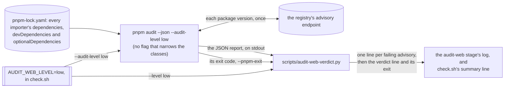
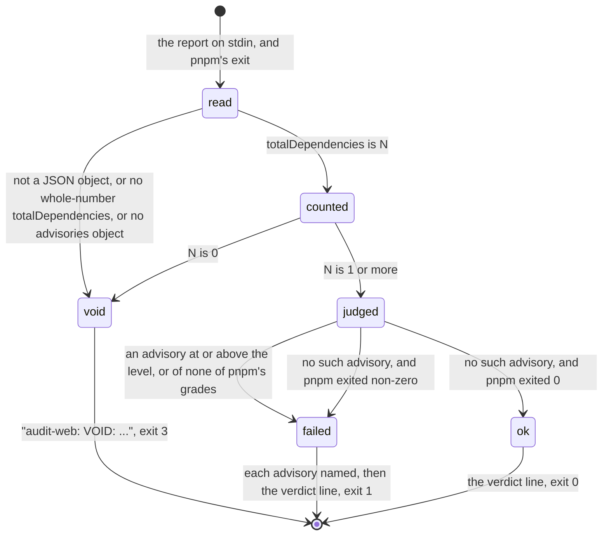

# Schematic: the web audit, from pnpm's report to the stage's verdict

Kind: data flow and state machine. Read at DeckStreak `dev` 16ed8e2 (`scripts/check.sh`,
`pnpm-workspace.yaml`) and pnpm 11.27.1's JSON audit report. Decided by ADR-055's note of
2026-09-28; built by SPEC-058.

## The data flow

The level is defined once and reaches both readers, so the report pnpm filters and the verdict that
judges it hold the same bar. A workspace's `audit.level` applies only when the command line names
none, so it cannot raise the bar the gate states. The count the verdict prints is
`metadata.totalDependencies`, beside the report's own `dependencies`, `devDependencies` and
`optionalDependencies`.

## The verdict

pnpm's grades, lowest first, are `info`, `low`, `moderate`, `high` and `critical`; `--audit-level`
takes the last four. An advisory fails when its grade is at or above the level, and one whose
severity is none of the five fails too, because a grade the verdict cannot place is never read as
clean. The report decides: an advisory it holds fails the stage whatever pnpm's exit was, and a
pnpm that exited non-zero is never a pass.
