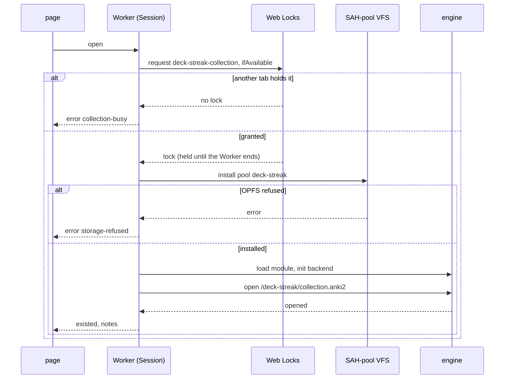
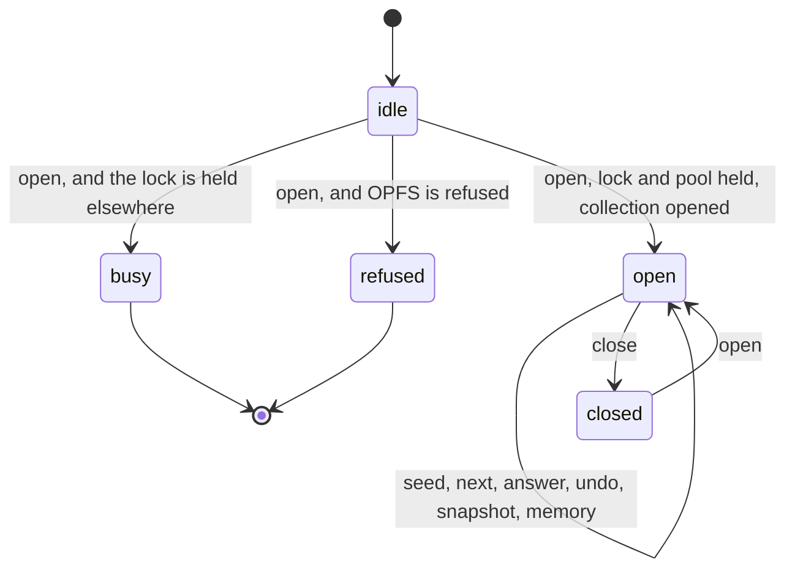

# Schematic: the web engine, from the page through its Worker to the engine and OPFS

Kind: data flow, with the open order as a sequence and the Worker's session as a state machine.
Read at DeckStreak `dev` f8b5dc3 (`web/app/svelte.config.js:19-22`, the page's policy;
`Cargo.toml:111-112`, the `[patch]` entry this delivery moves). Added by SPEC-338 under ADR-348
and ADR-349; the web client's place among the app's clients is drawn in
`app-clients-engine-and-sync.md`.

## The data flow

```mermaid
flowchart LR
  subgraph page["the page (main thread)"]
    screens["study screens (later deliveries)"]
    client["EngineClient: id-paired requests"]
    persist["persistence: navigator.storage.persist()"]
  end
  subgraph worker["dedicated module Worker"]
    entry["worker.ts: the Worker's scope"]
    session["Session: the protocol's operations only"]
    lock["Web Lock deck-streak-collection, ifAvailable"]
    module["deck-streak-web-engine: wasm-bindgen exports"]
    engine["Anki's engine (the fork's pinned commit)"]
    vfs["SAH-pool VFS, directory deck-streak"]
  end
  opfs[("OPFS: the origin's private file system")]
  sync["sync at session start and end (#35;631)"]

  screens --> client
  screens --> persist
  persist -- "persisted, not-persisted, unsupported" --> screens
  client -- "postMessage: id, op, args" --> entry
  entry --> session
  session -- "1: take before anything else" --> lock
  session -- "2: install the pool" --> vfs
  session -- "3: load and init the module" --> module
  module -- "run_service_method" --> engine
  engine -- "rusqlite on sqlite-wasm-rs" --> vfs
  vfs -- "SyncAccessHandle, exclusive" --> opfs
  entry -- "postMessage: id, value or error code" --> client
  sync -. "planned: the browser's transport" .-> engine
```

- The page never holds the engine, the pool or a SQL handle. Its only path is `EngineClient`'s
  messages, and the Worker answers each with the request's id.
- Both listeners check the sender's origin: a message with an empty origin, as the Worker's channel
  delivers it, or the receiver's own origin is heard, and any other is dropped unanswered.
- The persistence request runs on the page, because `navigator.storage.persist()` exists on the
  window only. Its answer is shown, never assumed.
- The sync attaches inside the Worker, beside the engine, at session start and end. Its transport
  refuses on `wasm32` today (the fork's `browser-fetch` patch), and the web sync screens decide it
  (#631).

## The open, as a sequence

- The lock comes first, so a second tab never installs a pool: the pool's access handles are
  exclusive, and a second install would fail or contend instead of refusing by name.
- A collection the browser evicted reopens empty with `existed: false`, which the screens show
  and the sync at session start repairs (#631).

## The Worker's session, as a state machine

- `busy` and `refused` are terminal for that Worker: each answers its error code and loads no
  engine. A request other than `open` before the session is open answers `not-open`, and a
  malformed request answers `bad-request` in every state.
- `memory` reads the module's linear memory in bytes. It never shrinks, so the reading after a
  step is the high-water so far; the measurements read it after each step (SPEC-338 R3).
