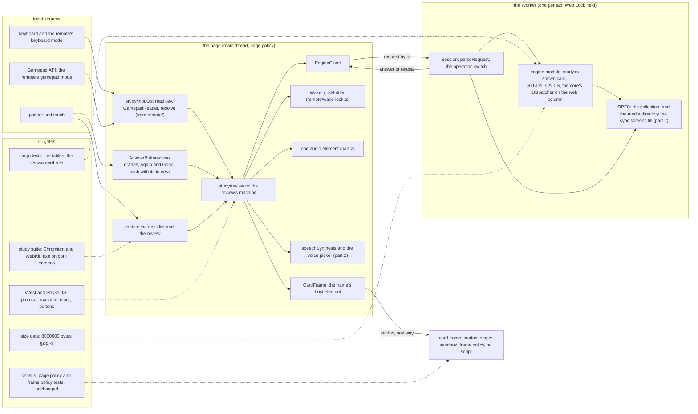
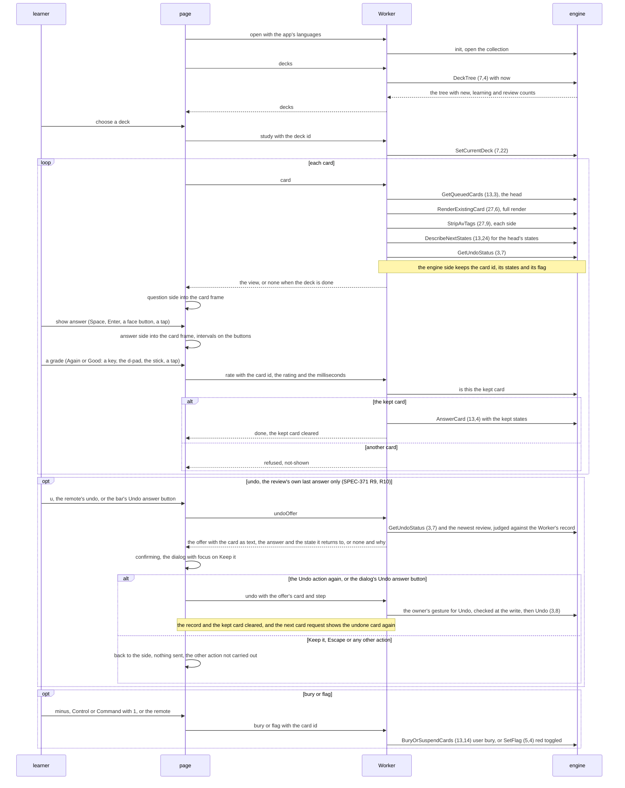
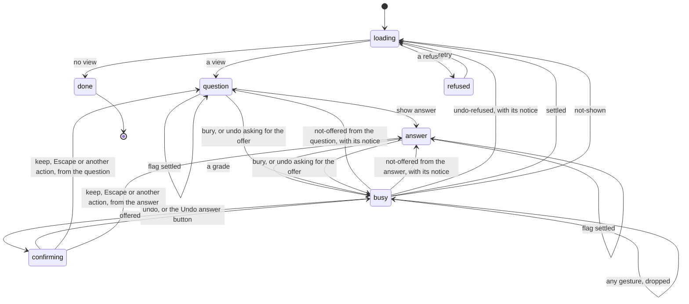
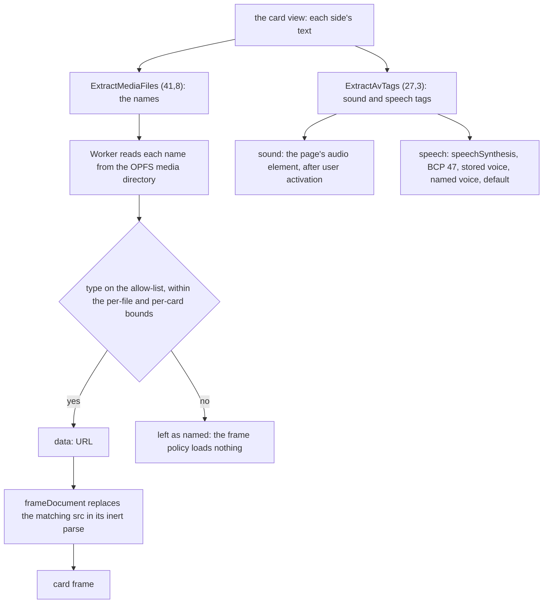
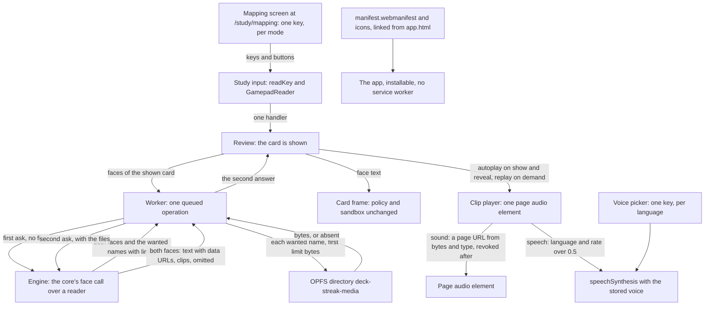
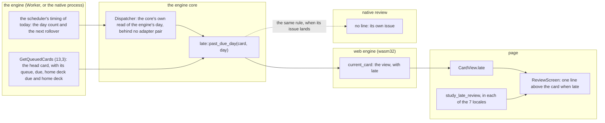
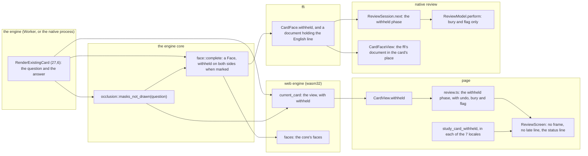
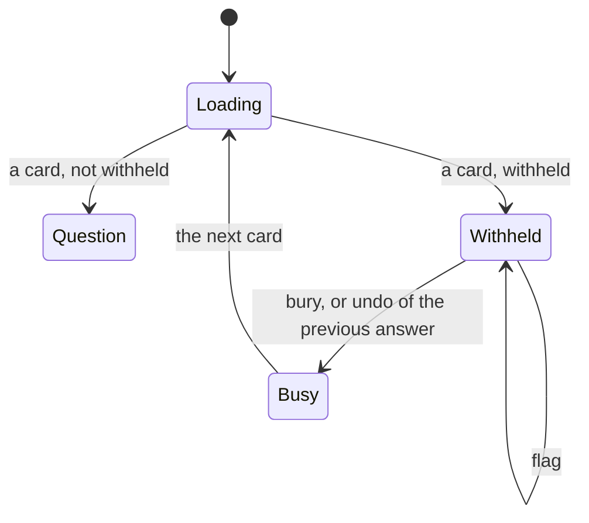

# The web study screens: components, the review loop and its states

Read at: the base `ac4fbdaeb02f682991a9b26db539dbc20c8ff559` (`dev`), #662's head
`af6da34688467f8866167c4affbb53a45cca9d8b`, #663's head `d13f28f47c7088a22abf76ac7eeb5de86b1c92a7`,
and the engine fork's pinned revision `c538de55a23e695234e794029fce0dafff2d36a9`. Every `path:line`
below is at one of them, as SPEC-350 section 1 names. Decided by ADR-361.

## 1. Components

The page owns the screens, the input, the players and the frame's host element. The Worker owns the
engine and storage. The card frame is a sealed document the page writes once per side and never
hears from. Part 2's units are marked.

### What crosses each edge

| edge | carries | never carries |
|---|---|---|
| input to the machine | an intent (`confirm`, a grade, `undo`, `bury`, `flag`, `replay`), read against the side | a key or button the map does not name; a key typed into a control; a repeat |
| the machine to `EngineClient` | `decks`, `study`, `card`, `rate`, `bury`, `flag`, `undoOffer`, `undo` with the card and step the offer named (SPEC-371 R9, R12) and `open` with the languages | `next`, `answer`, `seed`, `snapshot` (the harness's) or any pair |
| `EngineClient` to the Session | a numbered request; the reply settles it by id | a message from any origin but the page's own |
| the Session to the engine | one named export per operation, each crossing the Dispatcher on the web column | `run_method`, `run_exempt`, SQL |
| the host to the frame | the composed `srcdoc`: the frame policy, the card's CSS, the card's body with its classes, and (part 2) `data:` URLs in `src` | a script, a `blob:` or network URL, a token, a message channel |
| the frame to anything | nothing | everything: no listener exists, and the frame runs no script |

## 2. The review loop

Deck, next card, show, reveal, rate, next. The page keeps only which side is shown; the engine side
keeps the shown card.

## 3. The review's states

`review.ts` is a table, as #663's wake lock is: every event passes through one step function, and a
gesture while a request is in flight fires nothing.

A card the frame refuses (`escaped`) stays in `question` or `answer` with a message in place of the
frame: its controls stay usable, so the learner can still rate, bury or flag it.

## 4. Media, sound and speech (part 2)

The seams the web sync screens (#631) need: the OPFS media directory's name and layout, which their
media transport fills; the deck list's empty state, whose one action opens their entry; and the
Worker, whose lock their sync must hold while it writes the collection.

## 5. Media, sound and speech through the core's face (part 2)

Section 4's Worker-built `data:` URLs are superseded (ADR-361 D12). The Worker asks the engine for
the shown card's two faces twice, inside the one queued operation, so no second actor appears: the
first ask answers the media names the core wanted, and the second carries their bytes. The page
plays the face's clips; the frame receives only the face's text. The install surface and the
mapping screen sit beside the review.

## 6. The late line: the due day from the engine to the review (SPEC-376)

Read at the base `5fe4a48a09bc72700f434e7747ad64916af76902` (`dev`). Decided by ADR-387. This
section is appended to `docs/schematics/web-study-screens.md`; no line above it changes.

The due day has one source, the shown card's own fields in the engine's day, and one rule, the
engine core's `past_due_day`. The web engine carries the rule's answer to the page as the card
view's `late`; the page draws one line from it. The native review reads nothing yet (`#738`).

### 6a. Data flow, per client

### 6b. The rule

| the card's queue | its due day | past its due day when |
|---|---|---|
| review, or day learning | its home deck due when it sits in a filtered deck and that due is set, else its own due | that day is earlier than the engine's day count |
| intraday learning | its due instant | that instant is earlier than the engine's next rollover less one day |
| new, preview, or any other | none | never |

### 6c. What crosses each new edge

| edge | carries | never carries |
|---|---|---|
| the engine to the core's day read | the day count and the next rollover, decoded from the engine's own reply | a clock read by the core itself; an adapter's request |
| the core's rule to the web engine | one boolean for the card the view shows | the due day, the day count or a date |
| the web engine to the page | `late` on the card view, built when the card is shown | a number, a date or a count of days |
| the page to the learner | one line in the app's locale, on both sides of the card | the due date, the days overdue, a word of blame |

### 6d. When the day turns

The view is built when the card is shown. A card shown before the rollover and answered after it
keeps the view it was shown with: a card due today shows no line and is then answered past its due
day (the line is absent, never false); a card past its due day when shown is still past it when
answered (the line stays true).

## 7. The withheld occlusion question: from the engine to both reviews (SPEC-380)

Read at the base `e7ecf10d6b796eb1f86fe6544e04a96a0583c791` (`dev`). Decided by ADR-391. This
section is appended to `docs/schematics/web-study-screens.md`; no line above it changes. The native
review's withheld phase is drawn in `docs/schematics/ios-review-screen.md` section 6.

An image occlusion question has its masks drawn by a script, and no review runs card scripts
(ADR-352 D1). The question has one rule, the engine core's `occlusion::masks_not_drawn`, read over
the rendered question. A marked question is withheld on both sides, on both reviews: the web
review shows one line in every locale, and the native review shows the ffi's English line in the
card's place. Neither records a rating, and the card stays due.

### 7a. Data flow, per client

### 7b. The rule

| the rendered question holds | marked | the notes it meets |
|---|---|---|
| the engine's mask layer | yes | a stock occlusion note, with shapes, with no shape, or with a malformed shape field |
| an occlusion shape, without the mask layer | yes | a cloned or custom type whose template dropped the layer |
| neither | no | a plain card, a text cloze, an image; and, unseen, an older note whose masks are separate images (SPEC-380 section 5) |

The marker names are measured by the build on a note the engine builds, and named in the rule's
doc comment.

### 7c. The web review's withheld state

- In `Withheld`, show-answer, replay and every rating have no row in the review's table: a key,
  button, remote or stick press there is not a transition, and no rating is sent.
- The status region shows `study_card_withheld` where the escaped card's line is shown; the card
  frame and the late line are not drawn.
- The card stays due; only the learner's own bury moves it.

### 7d. What crosses each new edge

| edge | carries | never carries |
|---|---|---|
| the engine's render to the core's rule | the rendered question | the note's fields, its type's kind |
| the core's rule to the core's face and the web engine's view | one boolean for the card | the question's text, the markers |
| the core's face to the web engine's faces and the ffi | a withheld face: no text, no note CSS, no clip | the image, the shapes |
| the web engine to the page | `withheld` on the card view, with an empty question, answer and CSS | the image, the shapes, a reason code |
| the ffi to the native review | `withheld` on the card face, and a document holding the English line | the image, the shapes, a script |
| either review to the learner | one line, and the learner's own bury and flag | a rating, an automatic bury |
