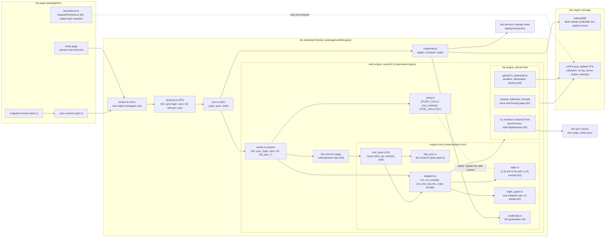
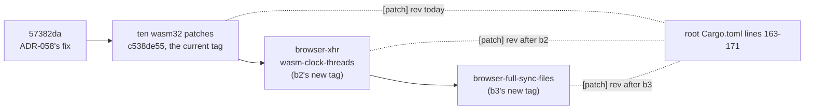
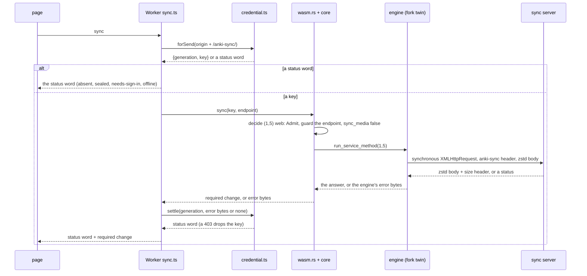
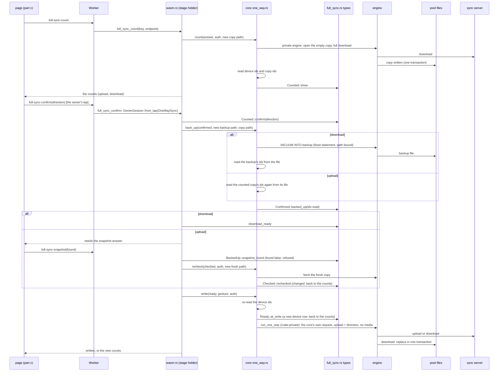
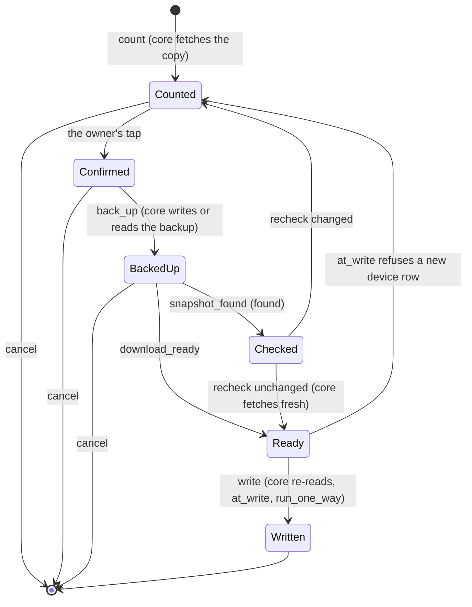
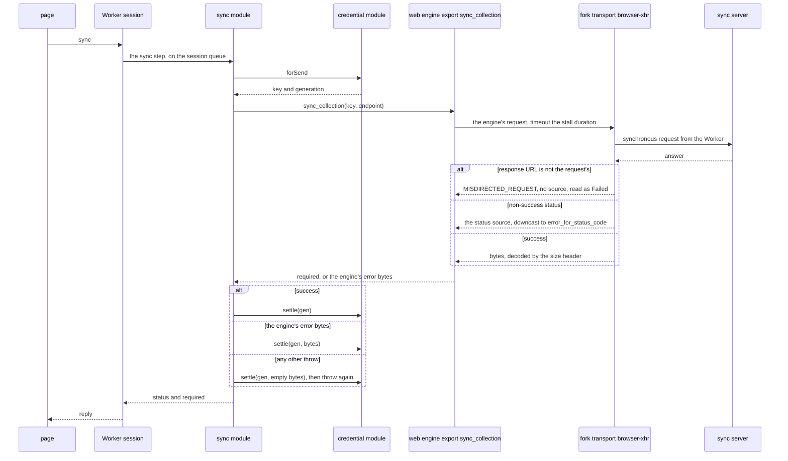

# Schematic: the web client's sync and its full-sync write (`SPEC-364`)

Read at DeckStreak `dev` `dee337bc` and the engine fork at `c538de55`. Every `path:line` below is
from those trees. Parts b1, b2 and b3 are marked where a component arrives.

## 1. Components

What crosses each boundary:

| boundary | crosses | never crosses |
|---|---|---|
| page to Worker | operation names, the sync user and password once (`sync-login`), the owner's direction and the snapshot's `found` | the key, the host key, ids or paths |
| Worker to page | status words, the counts, the sync's required change | any key, any id set, any path |
| `sync.ts` to `wasm.rs` | the key and endpoint `forSend` answered, for one call | a stored copy of the key |
| core to engine | requests the core built or checked (`run`, `run_one_way`), fixed statements | a caller's one-way request bytes |
| engine to network | the engine's own request, the `anki-sync` header among its headers, to the page's own origin | any other origin (`connect-src 'self'`) |

## 2. The fork pin

Each step is a fast-forward of the pin branch with a new tag; no tag moves or is deleted while
pinned (ADR-348). Each patch is a `cfg` on `wasm32`; the native engine is the one pinned before.

## 3. A normal sync (part b2)

Part b2 as built is section 7: the export is `sync_collection`, and every send settles.

## 4. The full-sync write (part b3 over b1's driver)

## 5. The choice's states and who drives each step

## 6. The gates

| gate | holds | where it runs |
|---|---|---|
| `table`, `login_guard`, `exempt`, `one_way` tests (b1) | the rows, the endpoint rule, the one-way refusal, each step's order against the engine's own sync server | the repository's `rust` job |
| `containment`, `graph` (b1) | `run_one_way` named outside the core only in the entry files; no new dependent of the core | the `rust` job |
| `parity` (b1), the web engine's `study` test (b1) | the web column equals `STUDY_CALLS` with `SYNC_CALLS`; `SYNC_CALLS` is exactly the login and the normal sync | the `rust` job |
| mutation rows `S36401` to `S36421` (b1) | each step's check against its killer | the `mutation-rows` job |
| `boundary` census (b2, b3) | each new web export's owed statements | the `rust` job |
| `credential-reach`, `sync.test.ts`, `engine.test.ts` (b2) | the key's one holder, settle after every send, persistence each session | the `web` job |
| the engine's browser tests (b2, b3) | the transport and the write in Chromium and WebKit against the engine's own sync server | the `web-engine` job, after the build and its size bound |
| `formal/tla/FullSyncChoice` | the order; every covered anchor's digest unchanged | the formal checker outside this repository's CI |

## 7. A normal sync as built (part b2)

A sequence, read at dev `a6a44fa6` and the fork's `c538de55`. The Worker's `sync` takes the key at
the send, the engine's export sends through the fork's synchronous transport, and the send settles
on every path (ADR-375 D14 to D19).

