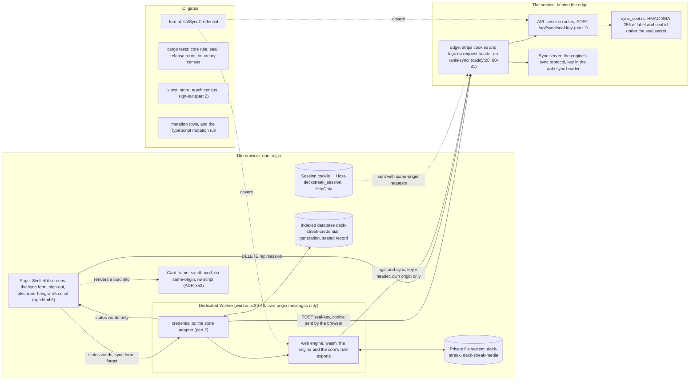
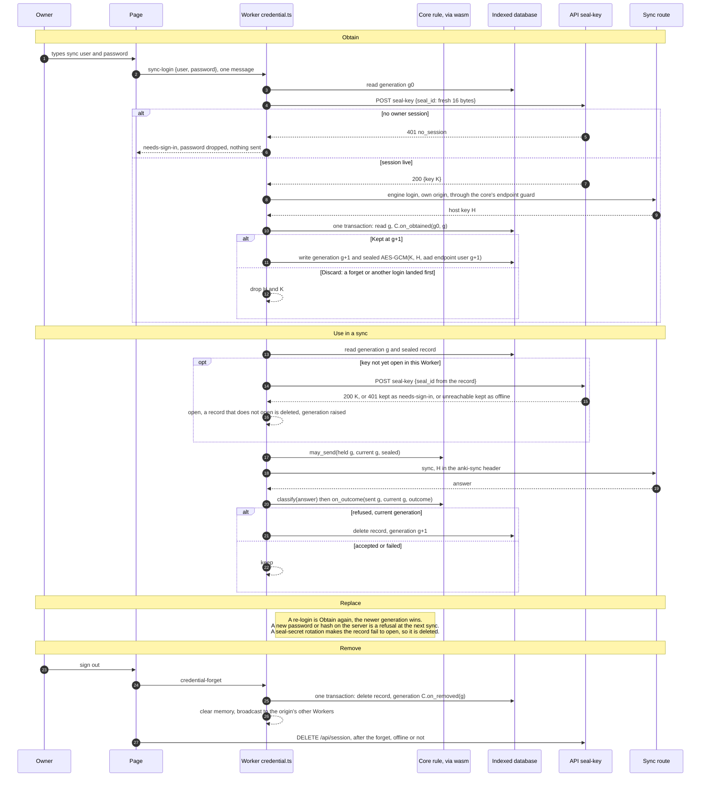
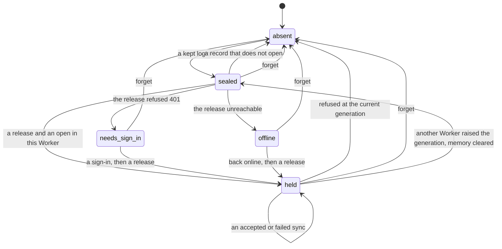

# Schematic: the web client's sync key, from login to removal

SPEC-363 and ADR-374. Every `path:line` here was read at DeckStreak `dev` `33033b65`, and
every fork citation at the engine fork's pin, `c538de55`. This schematic is drawn before the code,
and part 2's components are marked as such.

## 1. Components, and what each can reach

| part | can reach | cannot reach |
|---|---|---|
| card frame | its own face's markup | the origin's storage, the cookie, the Worker, the network: its origin is opaque and it runs no script (ADR-352) |
| a page script, Telegram's included | the sealed record, the release route while a session is live, the sync form while the owner types | the cookie's value; the Worker's memory; the opened key in any reply |
| the Worker | the store, the release, the opened key in memory, its own origin's sync route | any other origin (`connect-src 'self'`, svelte.config.js:30; the core's endpoint guard) |
| the API | the seal secret (its unit's credential `sync-seal-secret`; until the host step loads it the release answers 404 `sync_seal_off`), the session store | the host key, the sync password, the sealed record |
| the edge | the sync route's address and path | any request header on the sync route (caddy:28), any cookie on it (caddy:80-81) |

The accepted residual is the second row: a same-origin script during a live session can open the
record (ADR-374 Consequences). Telegram's script, which loads on every route (app.html:6), is one
(SPEC-400 has since removed app.html:6, so Telegram's script now loads only on a launch from Telegram)
such script, and ADR-374 names it as the accepted residual of this design.

## 2. The key's life: obtain, store, use in a sync, replace, remove

## 3. The record's states, as the status operation names them

Study reads none of these states: every study operation answers the same in each.

## 4. The model's shape, `formal/tla/SyncCredential`

| model variable | stands for |
|---|---|
| `gen` | the stored generation |
| `sealed` | the stored record: none, or the generation and key version it was sealed at |
| `keyver` | the seal secret's version, moved by `Rotate` |
| `mem[w]` | what Worker `w` holds open: none, or a generation |
| `login[w]` | a login in flight in `w`: none, or the generation it started at |
| `inflight[w]` | a send in flight from `w`: none, or the generation it sent |
| `session` | whether an owner session is live |
| history booleans | a sign-out happened and no login started since; used by the properties |

Actions: `StartLogin` (needs `session`), `LandLogin`, `LoginFails`, `SignOut`, `Unseal` (needs
`session`), `DropStale`, `StartSend`, `Accepted`, `Refused`, `Failed`, `Rotate`, `SessionOpens`,
`SessionEnds`, `Restart`. Bounds: two Workers, generations up to 4, two key versions.

| property | the switch its witness turns off |
|---|---|
| `NoKeyAtRestAfterSignOut` | `CheckLoginGeneration` (`LandLogin` keeps every login) |
| `NoSendAfterSignOut` | `CheckSendGeneration` (`StartSend` ignores the stored generation) |
| `ARefusalDropsOnlyItsOwnKey` | `CheckRefusalGeneration` (`Refused` drops whatever is stored) |
| `AFailureKeepsTheKey` | `DropOnlyOnRefusal` (`Failed` drops the record) |
| `UnsealOnlyInALiveSession` | `ReleaseNeedsSession` (`Unseal` ignores `session`) |

Out of the model, by abstraction: the cipher (a record opens exactly under its own key version),
the nonce, the HMAC, and the bytes of the protocol. Each is held by a unit test and a mutation row
instead.
