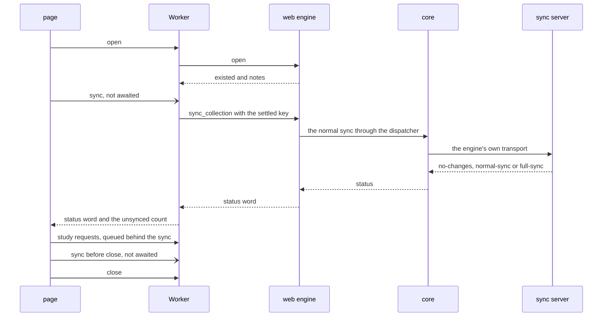
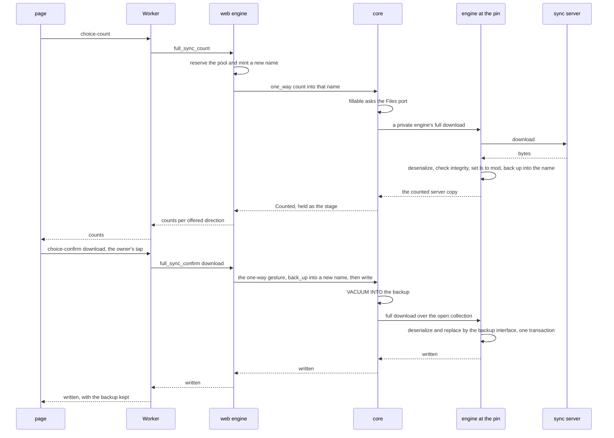
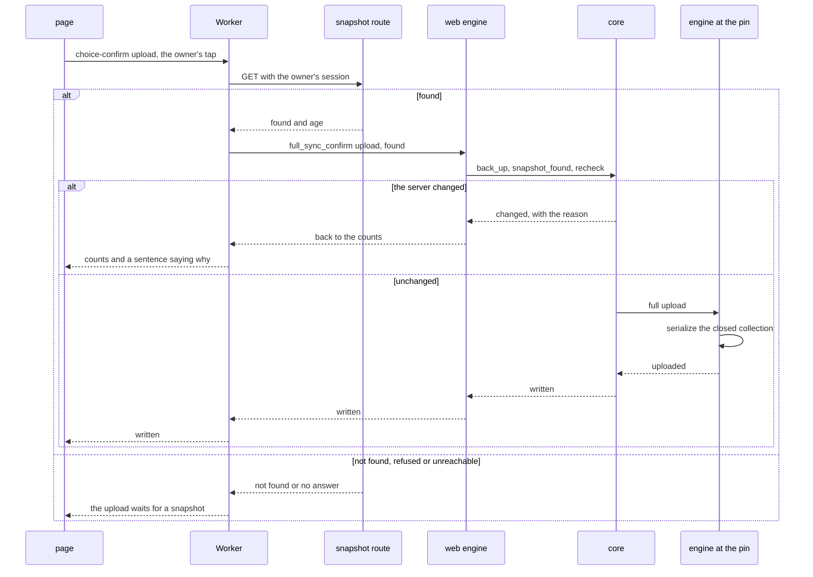
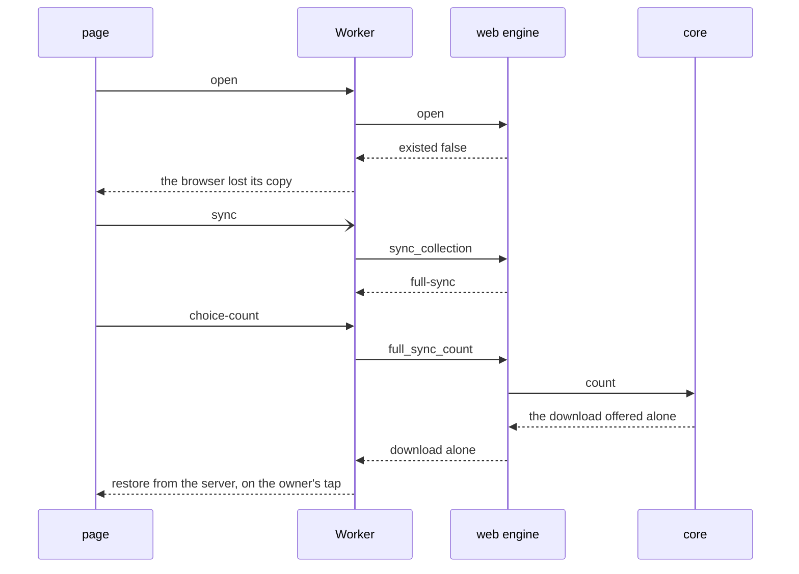
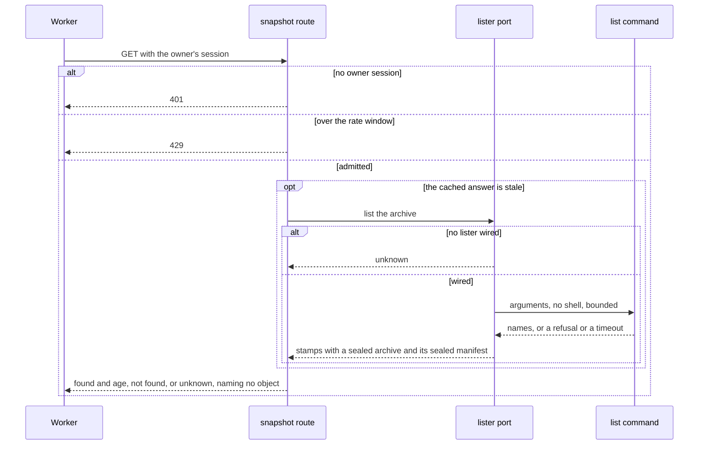

# Schematic: the web sync page, the Worker, the web engine, the core and the fork (SPEC-377)

Kind: sequence. Decided by ADR-388. The `path:line` citations were read at `dev` `f48a977c` and in
the engine fork at its pin `2cfa7047`; SPEC-377 section 1 gives the command for each.

Participants, the same in every diagram:

| id | is | where |
|---|---|---|
| `Pg` | the page: the study engine and the sync screen | `web/app/src/lib/study/engine.ts`, `web/app/src/lib/sync/` |
| `Wk` | the Worker: its session, its credential store, its sync and its choice | `web/app/src/lib/engine/` |
| `En` | the web engine: its exports, the pool's port and a choice's held stage | `crates/web-engine/src/wasm.rs`, `crates/web-engine/src/files.rs` |
| `Co` | the core: `one_way`, the dispatcher and the `Files` port | `crates/engine-core/src/` |
| `Fk` | the engine at the fork's new pin | the fork's `rslib/src/sync/` |
| `Sv` | the sync server | the service's sync route |
| `Ap` | the service's snapshot route (part c2; a test route stands in for it in part c1's browser tests) | `crates/api/src/` |

## 1. A session's two syncs (part c1, R7)

The page posts each sync and awaits neither; the Worker's one queue orders them with study.

## 2. The choice, a download (part c1, R5, R9)

The page passes a direction and nothing else. Every path is a new pool name the web engine mints
after a reserve.

## 3. The choice, an upload (part c1, R5, R6, R9)

The Worker reads the snapshot answer itself; `unknown` refuses the upload as `not found` does.

## 4. A collection the browser evicted (part c1, R10)

## 5. The snapshot route (part c2, R12 to R14)

