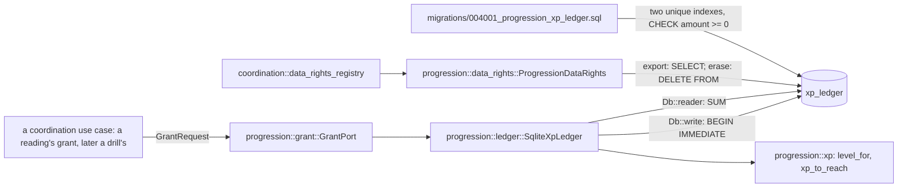
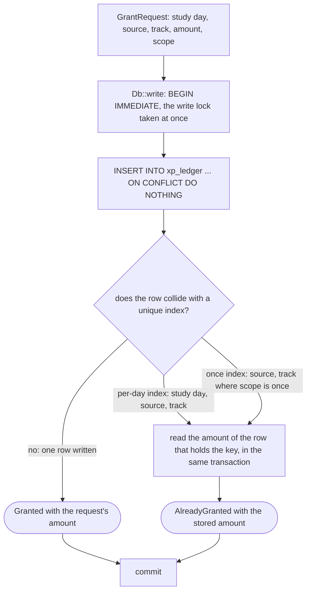
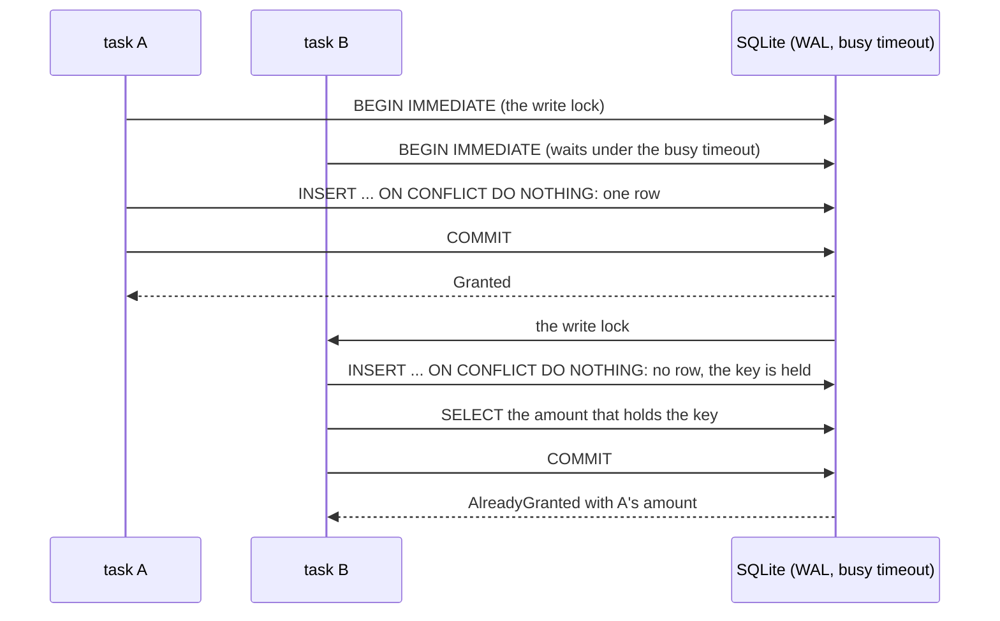
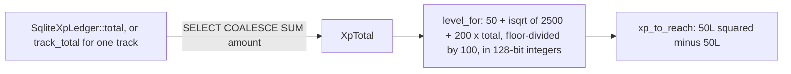

# Schematic: the XP grant port, its ledger and the level read from it

Kind: component, data flow and sequence. Read at DeckStreak `dev` 16ed8e2 (the kernel's repository
base, `crates/kernel/src/db.rs`; its data-rights port, `crates/kernel/src/data_rights.rs`; and
coordination's registry, `crates/coordination/src/data_rights_registry.rs`), and at the
predecessor's `27ee2bc` for what it ports (`database.py:GamifyStore.upsert_xp_grant`,
`gamification/xp.py:level_for_xp`). Decided by ADR-040; built by SPEC-040.

## 1. The components

Every write of `xp_ledger` is progression's: the grant port inserts, and the data-rights port's
erase deletes every row when the owner erases their data (CHARTER 13). Nothing updates a grant or
debits one, and no other crate names the table in a query (A9). A context that grants XP reaches
the port through a coordination use case, never directly (docs/CONTEXT-MAP.md).

| type | what it is | why |
|---|---|---|
| `XpAmount` | one grant's XP, an unsigned 32-bit newtype | built only from an unsigned integer, so a debit does not compile (CHARTER 5, A6) |
| `GrantSource` | an opaque token, `^[a-z0-9][a-z0-9:._-]{0,127}$` | refused at construction, before any write, by an error that names the rule and never the value (A8) |
| `GrantScope` | `per-day` or `once` | picks which unique index holds the key (ADR-040) |
| `GrantRequest` | study day, source, track, amount and scope | the whole of what a grant says (R2) |
| `GrantAnswer` | `Granted(amount)` or `AlreadyGranted(amount)` | a replay says so, carrying the amount the ledger already holds (R3) |
| `XpTotal` | the sum of every amount, or of one track's | a 64-bit unsigned total, read from the ledger each time (R7, R8) |
| `Level` | the largest level whose threshold a total reaches | derived from a total, never stored (R8) |

## 2. A grant

The key lives in the migration alone: the insert's own conflict with the two unique indexes is the
existence check, so no check in code can disagree with the index (R4, R5). `ON CONFLICT DO NOTHING`
answers a uniqueness conflict only; a negative amount written by any path still fails the table's
`CHECK (amount >= 0)` (A7). The read that follows a conflict finds the row by the key the request
collided with: the same study day, source and track, or, for a `once` request, the `once` row of that
source and track on any study day.

| index | columns | rows it covers | what a second request meets |
|---|---|---|---|
| `xp_ledger_per_day` | `study_day, source, track` | every row | the same source and track on the same study day, whatever its scope |
| `xp_ledger_once` | `source, track` | rows whose scope is `once` | a `once` grant of the same source and track, on any study day |

## 3. Two requests for one key at once

Whichever task takes the lock first writes the row; the other writes nothing and answers with the
amount the first wrote (A3).

## 4. The total and the level

No level is stored, so none can drift from the ledger (R8). The square root is an integer square
root and the division floors, never a floating-point root, and the arithmetic is 128-bit, so the
widest total a 64-bit ledger can hold has its level. The parity golden `level_for_xp` proves both
against the predecessor's own function (A4).

How far a floating-point root drifts was measured by a scan of every level from 2 to 3 × 10^7, at
its threshold and one XP below it, comparing the integer formula with two double-precision ports,
each emulated step by step in IEEE doubles. A port that rounds the exact `2500 + 200 × total` to a
double once, then takes its square root, first reads the total one XP below a threshold a level too
high at level 10,737,419 (a total of about 5.8 × 10^15 XP), and does so at every level from
18,958,242 to the end of the scan. A port that computes every step in doubles goes wrong sooner,
from level 8,388,610 (about 3.5 × 10^15 XP), and from level 26,843,551 it also reads some
thresholds a level too low.
