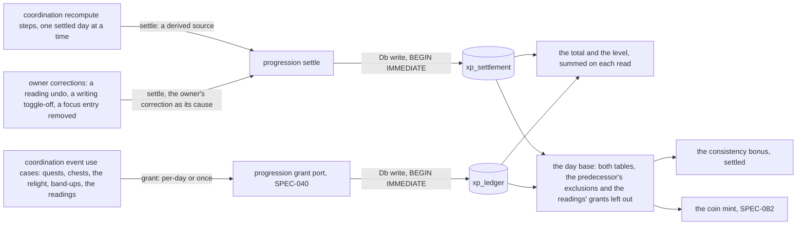
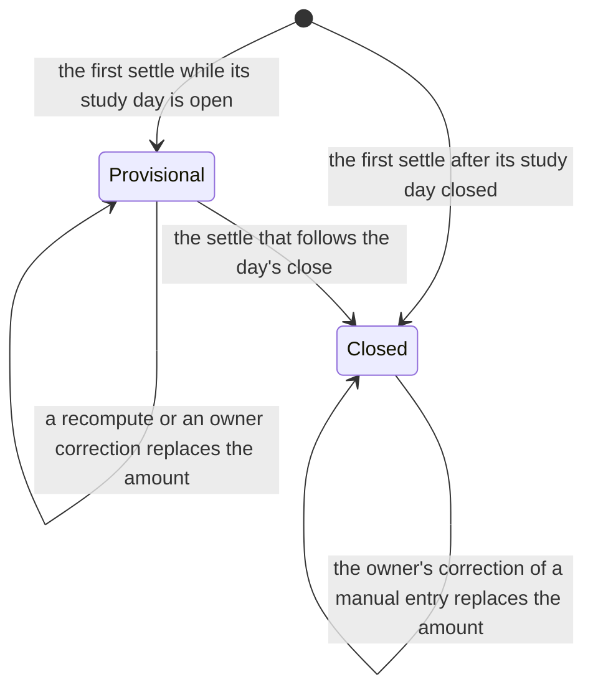
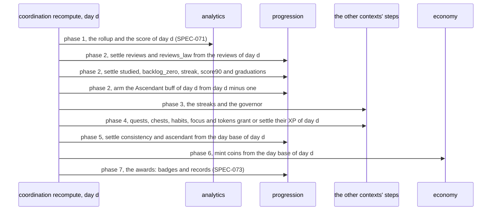
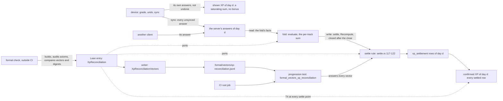
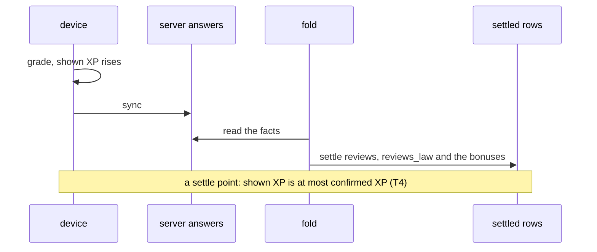

# Schematic: XP grants, XP settlement and the level read from both

Kind: data flow and state machine. Read at DeckStreak `dev` c3d769b and at SPEC-040's delivery
(the grant port, `xp_ledger`, ADR-040), and at the predecessor's `27ee2bc` for what it ports
(`pipeline.py:GamifyPipeline._recompute_day`, `database.py:GamifyStore.upsert_xp_grant`,
`database.py:GamifyStore.clear_xp_sources`, `database.py:GamifyStore.day_base_xp`,
`pipeline_layers/governor.py:GovernorLayer._apply_day_bonuses`). Decided by ADR-072, beside ADR-040
and ADR-071. Added by SPEC-072.

## 1. Two ways XP is written, one way it is read

`settle` refuses any source outside the derived registry before a write, and only coordination's
recompute steps and its owner-correction use cases call it. The grant port is SPEC-040's, unchanged:
it never updates or deletes a grant. No level is stored: it is derived from the summed total each time
it is read (SPEC-040 R8).

## 2. One settled row: study day, source and track

While a study day is open its derived XP follows the record, as the predecessor's current day does,
and can fall (a score that drops below 90 before the day ends takes its bonus back). Once the day has
closed, only the owner's own correction can lower it; a later recompute, for example after a review
synced late, can only raise it. The predecessor's recompute lowers a closed day instead: it deletes
the study-owned sources and writes back only those that still qualify, and `backlog_zero` qualifies
only for the current study day (ADR-072).

## 3. The phases of one day's XP

SPEC-071's fold settles a day in seven phases, declared once in
`crates/coordination/src/recompute/mod.rs`. SPEC-072 registers its XP steps in phases 2 and 5.

The derived bonuses come after every base source of the day, which is the value the predecessor's
recompute reaches once it has run again after a quest paid; the mint follows them. The buff is armed
in phase 2 so that the chest roll of phase 4 reads it (SPEC-081). `backlog_zero` is true only for a
day evaluated with its card snapshot: the current day, or a closing day at its settle with its
end-of-day snapshot (ADR-071). `score90` reads the current day's live score, and a closed day's
`score_at_close` (SPEC-071).

| what | read from | why |
|---|---|---|
| the total, per track and overall | `xp_ledger` and `xp_settlement` | every XP the owner holds, grants and settled amounts alike |
| the level and its title | the total | derived at read, never stored |
| a day's XP by source | both tables, that study day | the Mini App's breakdown of today's XP |
| the day base | both tables, that study day, minus the exclusions | the input of the consistency bonus and of the coin mint |
| the Ascendant buff of day d | `buffs`, armed from day d minus one's settled `backlog_zero` | read by the Ascendant grant and by the chest roll (SPEC-081) |

## 4. The floor: confirmed XP is never below the XP shown (added by SPEC-389)

Kind: data flow and component. Read at DeckStreak `dev` `3ca06142`. Decided by ADR-403.

SPEC-334 R13 puts per-review XP on the device at once, and day-level bonuses wait for the sync. The
server's settled rows then confirm the day, and confirmed XP is never below shown XP. No client
computes XP at `3ca06142`, so shown XP is R13's definition (SPEC-389 R1), and #639 builds it. The
Lean entry proves the floor over the server's half, and the shipping settle rule answers its
vectors.

A *settle point* of day d is a state in which every answer the device holds for d has synced, and
the last write to d's rows came from a fold whose facts held every answer the server holds for d
(SPEC-389 R3). Between a grade and its sync, shown XP runs ahead by design. Two folds overlap
(`formal/tla/FoldSettlesOnce/FoldSettlesOnce.tla:14-16`), and each writes the current day from facts
read at its start (`crates/coordination/src/recompute/mod.rs:512-513`, `:574-577`). So a write from
older facts that lands last ends a settle point until the next fold.

| boundary | what crosses it | what holds it |
|---|---|---|
| the settle rule to the entry | the held row, the request and the cause, to the row held after | a `covers` digest on `settle`, and the 144 settle vectors the shipping `settle` answers (A1) |
| the fold to the entry | each answer's track and XP, to each track's saturating total | a `covers` digest on `evaluate` |
| the price to the entry | the premise that each answer shows at most its server price | `covers` digests on both `review_xp`; `economy.json`'s least tier multiplier is the untagged one |
| the protocol to the shipping rule | every settle of every trace of six letters, of length 1 to 4, and each settle point's shown and confirmed XP | the 1554 trace vectors, replayed through the shipping `settle` (A2) |
| the entry to the checker | the theorems, their witnesses, the axioms used and the vectors' bytes | the formal check: `MODEL_ERROR`, `HOLE`, `WITNESS_SURVIVED`, `DERIVED_DRIFT` and `STALE` |

The theorems are T1 to T4 of SPEC-389 R7. T1 and T2 are the settle rule's half of section 2's state
machine: a closed row never falls under a Recompute, and the close keeps the last provisional
amount. T3 says a day's review total never falls as answers arrive. T4 is the floor. An answer that
leaves the ingested scope, and a replaced collection, are not events of the model (#631, #639).
